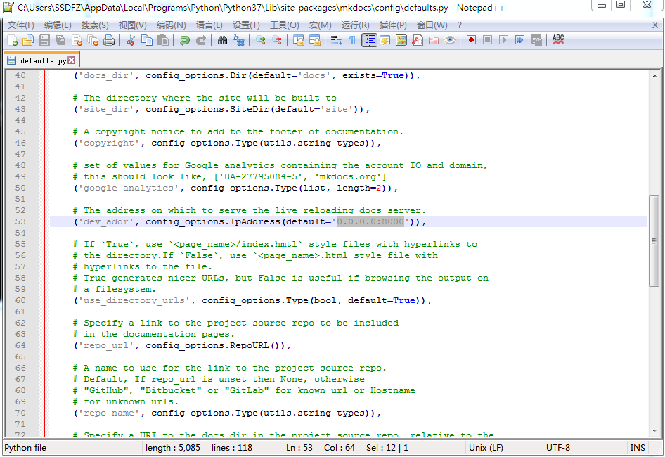

# Mkdocs
## 关于
* 本文档的撰写软件
* markdown to static HTML site
* [Origin](https://www.mkdocs.org/)

!!!failure "警告"
    * [Mkdocs中文文档](https://markdown-docs-zh.readthedocs.io/zh_CN/latest/)并非最新版本，可能出现差错（严重致命错误）

## 安装（Windows）
* <https://www.python.org/downloads/windows/>安装Python（安装时勾选讲Python加入PATH）
* <https://pip.pypa.io/en/latest/installing/>下载`get-pip.py`
* 下载完毕后（且Python安装完毕后）可以直接打开`get-pip.py`，也可以在此处打开命令行（或PowerShell，下同）输入指令`python get-pip.py`或`start get-pip.py`
* 安装`mkdocs`，命令行输入`pip install mkdocs`

## 局域网访问
* `:::js mkdocs serve`命令会默认监听localhost(127.0.0.1:8000)
* 如此在局域网就无法访问（Eg:局域网IP：192.168.1.100）
* 在配置文件中进行修改：将默认IP改为0.0.0.0:8000（监听本地所有ip）
* 
* 该文件一般位于:`:::js %USERPROFILE%\AppData\Local\Programs\Python\Python37\Lib\site-packages\mkdocs\config`

## 样式/主题（Themes）
* [一些Mkdocs主题](https://github.com/mkdocs/mkdocs/wiki/MkDocs-Themes)
* 比较常用有：原版、ReadTheDocs
* 此处使用Material主题

???tip "Google-Material"
    * [Origin](https://www.material.io/)
    * Google设计的一种跨平台、跨设备的的**设计标准**
    * 如今你所见到的Google产品，基本样式都相同，无论是网页版本或是移动App，这需要归功于Material-design

???tip "Material-UI"
    * [Origin](https://material-ui.com/)
    * Material-Design的React组件
    * 不想用React，也有MaterialUI的Bootstrap版本，具体见润梦的正式报名页面

### Material
* [DOCS](http://squidfunk.github.io/mkdocs-material/)
* [Github](https://github.com/squidfunk/mkdocs-material)
* 使用字体：Ubuntu、Ubuntu Mono（从GoogleFont）

