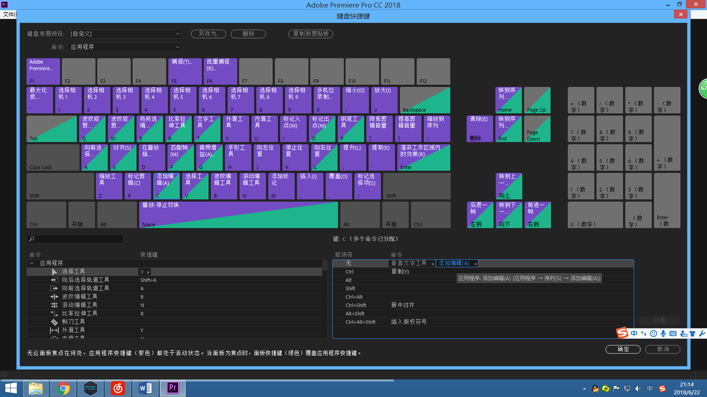

# Adobe系列
## 下载
* 欢迎使用百度云
* Adobe_CC2018_Win链接: <https://pan.baidu.com/s/1KgyyRANJ4orpwM6IVS9WNA>  密码: 54mh
* Adobe_CC2018_Mac链接: <https://pan.baidu.com/s/1LCuOzGDk25tKINJTsxW-cQ>  密码: sytv
* Adobe_CC2017_Win链接: <https://pan.baidu.com/s/1SKGWMFHGh3En279X7KmO2g>  密码: yf5z
* Adobe_CC2017_Mac链接: <https://pan.baidu.com/s/1NL84LcxrqO8uLFGGFCBmZA>  密码: suqe
* Adobe_CC2015_Win链接: <https://pan.baidu.com/s/1iKtFaGH3BdMOzXHOsSwZcQ>  密码: 7mqw
* Adobe_CC2014_Win链接: <https://pan.baidu.com/s/1n9LuZpR9mSZwCB0si9mdxQ>  密码: t549

## Adobe软件

!!!tip "提示"
    * Adobe Creative Cloud: [Origin](https://www.adobe.com/cn/creativecloud/catalog/desktop.html)
    * Adobe 所有产品 <https://www.adobe.com/cn/products/catalog.html>
    * 此处仅列出部分

* Photoshop
    * 图像编辑和合成。
* Lightroom
    * 随时随地编辑、整理、存储和共享照片。
* Illustrator
    * 矢量图形和插图。
* InDesign
    * 面向印刷和数字出版的页面设计和布局。
* Adobe XD
    * 设计和分享用户体验并为其创建原型。
* Adobe Premiere Pro
    * 符合行业标准的专业视频和电影编辑。
* After Effects
    * 电影视觉效果和动态图形。
* Acrobat Pro
    * 创建、编辑和签署 PDF 文档和表单。
* Dreamweaver
    * 设计和开发新式响应式网站。
* Animate
    * 适用于多个平台的交互式动画（以前称作 Flash Professional）。
* Adobe Audition
    * 录音、混音和复原。
* Lightroom Classic
    * 以桌面为中心的照片编辑。
* Character Animator
    * 实时将 2D 人物制成动画。
* Bridge
    * 集中管理您的创意资源。
* Media Encoder
    * 几乎可向任何屏幕快速输出视频文件。
* InCopy
    * 与文案人员和编辑合作。
* Prelude
    * 元数据采集、记录和粗剪。。

## 安装
1. 下载
2. 解压
3. 断网
4. 打开setup（如果有登陆界面，请断网）
5. 等待安装过程
6. 安装之后会显示登陆/使用，关闭该窗口
7. 打开<c><del>破解</del></c>补丁，选择安装的软件及相应版本（注意32/64x），单击Patch进行<c><del>破解</del></c>补丁
8. 关闭<c><del>破解</del></c>补丁，打开软件，会弹出协议，点击同意即可
9. 特别的，AME可以不须要<c><del>破解</del></c>补丁，但是还是推荐进行<c><del>破解</del></c>补丁，某些解析器需要<c><del>破解</del></c>补丁使用

!!!warning "安装版本和系统版本"
    * Adobe CC 2019需要Win10系统才能安装

## <c><del>破解</del></c>补丁
* CC2018：Adobe.CC2018.Anticloud.r3.exe
* CC2017-：adobe.snr.patch.v2.0-painter.exe
* CC2014-：adobe.snr.patch-painter.exe

## Acrobat
* 最新<c><del>破解</del></c>补丁可用版本：Acrobat DC 2015
* 安装后在设置首选项中关闭自动更新，否则会自动更新需要重装
* 为什么只有Acrobat的自动更新有效？…………天生神力
* 作为2015系列使用V2<c><del>破解</del></c>补丁

### Adobe PDF(虚拟)打印机相关
* 安装后若不存在，运行以下内容
* 使用bat文件运行
```js
net stop spooler
rundll32.exe setupapi.dll,InstallHinfSection AdobePDFPortMonitor 128 "C:\Program Files (x86)\Adobe\Acrobat DC\Acrobat\Xtras\AdobePDF\AdobePDF.inf"
net start spooler  
rundll32.exe printui.dll,PrintUIEntry /if /b "Adobe PDF" /f "C:\Program Files (x86)\Adobe\Acrobat DC\Acrobat\Xtras\AdobePDF\AdobePDF.inf" /r "Documents\*.pdf" /m "Adobe PDF Converter"  
pause  
```

### 插入页面功能注意
* 推荐先将页面打印成PDF后在插入，否则可能会比较卡
* （工序繁多，会先导出再插入，会陷入奇怪的状态）

## Premiere
### 轻松使用
* 将快捷键【C】从【剃刀工具】修改为【添加编辑】，按一下【C】即可切成两段
* 


   

   


