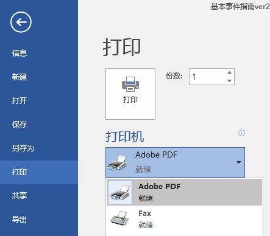
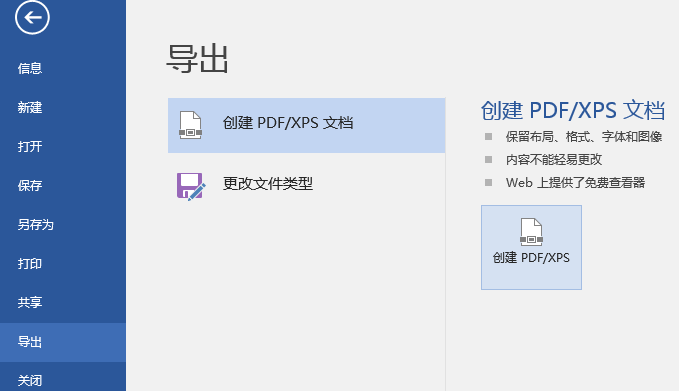
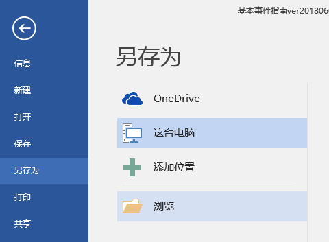
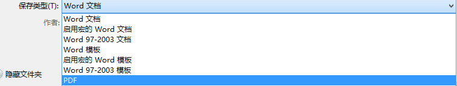
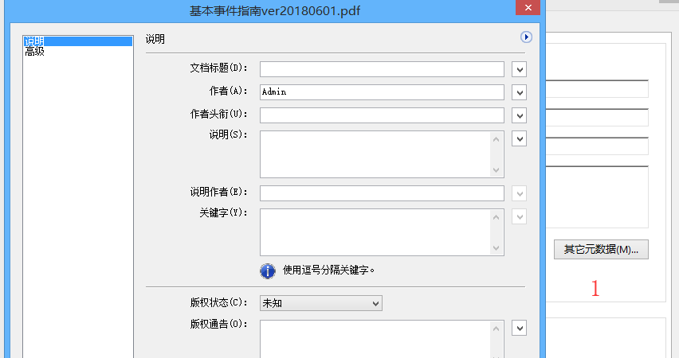
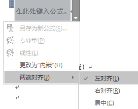
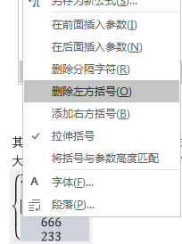

# Microsoft 系列

!!!note "简称"
    * 微软Microsoft有时简称MS（取首字母）
    * 如：msconfig(Microsoft System Configuration)、msdn(Microsoft Developer Network)

## 下载
* 推荐站点（MSDN，I tell you）：<https://msdn.itellyou.cn/>
* 需要注明的是，该网站并非微软官方，但完全免费，收费与下载无关
* 收藏夹里放放好，百度仿冒站点极多，不保证文件准确性
* 推荐下载工具（ED2K）：迅雷极速版（已停止更新，请使用安装包）

???question "为什么不使用最新版迅雷？"
    * 欢迎尝试迅雷浏览器10.0

???question "为什么不使用微软官方站点？"
    * 懒得爬墙
    * 国内速度较慢

* 
* 


## <c><del>破解</del>绿色</c>补丁

!!!tip "注意"
    * 此处仅照顾较新版本的情况

### 基本操作
* 使用：HEU_KMS_Activator_v11.2.0（或更新）
* 限定激活：批量授权版（VL）
* 官网未找到
* 实测：Win10商业版（business editions）中，无法激活

* 使用：KMSpico
* 实测：Win10商业版（business editions）中，激活为教育版
* 可能是官网：<https://kmspi.co/>

* 特例：Office2016批量授权版，在MSDN中没有

* SW_DVD5_Office_Professional_Plus_2016_W32_ChnSimp_MLF_X20-41351.iso  
* 940.74MB  
* 49D97BD1B4DFEAAA6B45E3DD3803DAC1  
```http
thunder://QUFodHRwOi8vZ2RsLmxpeGlhbi52aXAueHVubGVpLmNvbS9TVyU1RkRWRDUlNUZPZmZpY2UlNUZQcm9mZXNzaW9uYWwlNUZQbHVzJTVGMjAxNiU1RlczMiU1RkNoblNpbXAlNUZNTEYlNUZYMjAlMkQ0MTM1MSUyRUlTTz9maWQ9WmE0VVMrNUd3RmtGdCtIb0VneGdHTC9sWlc0QTZNczZBQUFBQU05OG5uZkE0UFlTYXFlbmRldXVDUW9EanNVTyZtaWQ9NjY2JnRocmVzaG9sZD0xNTAmdGlkPUE5QzUwOUJGNjI4NUMyMjFCODhCNUU2RUE5QUFDQzVDJnNyY2lkPTYmdmVybm89MSZnPUNGN0M5RTc3QzBFMEY2MTI2QUE3QTc3NUVCQUUwOTBBMDM4RUM1MEUmdWk9MTAwNDY5ODUxMyZzPTk4NjQ0MTcyOCZwaz1rdWFpY2h1YW4mYWs9ODowOjk5OTowJmU9MTQ0NDExNTQ1MyZtcz01MTIwMCZjaT0mY2s9Njc3OEZCNkM5Nzk4QjYzQzcwQjQ4ODk3QkQ5MjNGQ0UmYXQ9QTA5QjZBQjI4Q0ZCM0EzODZCRkIzOEUxQkI1NDNGNjEmaHk9MSZuPTBERTJFMUZGOTJCODNDMzA1RkZFRDBDNkJGOEQxRDVBNTBDM0Q5QzZCMzlEMEI2QzZGREZEN0NDODlCRTE0NzA3M0VFODQ5MEU3RDgyNzUyMzM4M0U5RTNCRTgwMkI2QzZEQzFFOUVEOUFBODI3NUQzMjgxOUI5NEU3REQ0RDM0MkVGOEU1RUZENkVFNzgwNTAwWlo=  
```

* SW_DVD5_Office_Professional_Plus_2016_64Bit_ChnSimp_MLF_X20-42426.ISO  
* 1123452928 B  
* MD5: 60DC8B1892F611E41140DD3631F39793  
* SHA1: AEB58DE1BC97685F8BC6BFB0A614A8EF6903E318  
* CRC32: 8D8AC6D1  
```http
ed2k://|file|SW_DVD5_Office_Professional_Plus_2016_64Bit_ChnSimp_MLF_X20-42426.ISO|1123452928|31087A00FF67D4F5B4CBF4AA07C3433B|/  
```


## Windows

| English | 翻译 |
| ------------------ |------------------- |
| Chinese-Simplified | 中文简体|
| business editions  | 商业版【企业版、教育版、专业版】（VL批量授权版）|
| consumer editions  | 消费版【家庭版、家庭单语言版、教育版、专业版、专业教育版、专业工作站版】 |
| multi-edition      | 多版本 |
| Enterprise         | 企业版 |
| Pro                | 专业版 |
| Education          | 教育版 |
| Language Pack      | 语言包 |
| VL / Vol           | 批量授权版 |
| Service Pack       | SP，服务包，大型补丁 |

## PE系统
* Windows Preinstallation Environment（Windows PE），Windows预安装环境
* 用于安装Windows，重置密码，硬盘分区等操作
* 推荐：WePE ：<http://www.wepe.com.cn/download.html> 
* 注意安装程序位数要求，即：安装64位使用64位PE
* 


## 安装
### 安装位置与应用程式
* 安装在系统盘（C盘）：直接setup.exe
* 安装在其他盘（多系统）：Source\install.exe
* BOOT引导文件：boot.wim
* 系统核心文件：install.wim，也可能是source.wim，根据版本不同

### 直接安装
* 除了32位不能安装64位系统，其他可直接挂载镜像文件进行安装
* 32位安装64位方法：
    * 1.使用PE系统安装
        * 先下载镜像文件（PE系统没有网）
        * 找到系统安装工具，选择iso文件，写入至c盘即可（可能需要格式化）
    * 2.使用NT10HDD进行安装
        * 下载NT10HDD，将ISO文件进行解压
        * 打开NT10，按照提示进行操作

### 关于WIM文件
* WIM: Microsoft Windows Imaging Format
* Windows的镜像格式，如果不需要引导文件，可以直接使用install.wim安装系统

### 虚拟桌面
* Win10自带，MacOs早有的功能
* <https://sspai.com/post/45594>
* <https://support.microsoft.com/zh-cn/help/4027871/windows-10-touchpad-gestures>

### 其他一些操作
* <https://sspai.com/post/45742>

## Office
### 安装注意
* 需要特别说明的是，尽管同时提供了32位和64位的Office，我们仍然推荐安装32位的Office
* 具体原因请查阅：<https://support.office.com/zh-cn/article/%E9%80%89%E6%8B%A9-32-%E4%BD%8D%E6%88%96-64-%E4%BD%8D%E7%89%88%E6%9C%AC%E7%9A%84-Office-ca3253e5-ac01-4242-8a64-b56111a6f32d>

### PDF导出
#### 基本方法
* 方法1：需要安装Adobe Acrobat，具体安装查看Adobe Acrobat项
    * 打印机安装成功后，可以选择Adobe PDF打印
    * 注意：只有A4页面可选，需要进行处理请在Acrobat界面进行剪切
    * 
* 方法2：Office自带(推荐)
    * 
* 方法3：Office自带
     * 
     * 

#### 特别注意
* 打开PDF文件，文件-属性
    * 
* 修改标题、作者、说明等信息

???question "为什么要修改？"
    * 我想你不会希望逼格降低，尽管只有Google Chrome（核心的）浏览器支持PDF查看
    * 


### Word

#### 代码格式插入
* 使用：<http://www.planetb.ca/syntax-highlight-word>
* 或Visual studio code：<https://code.visualstudio.com>

#### 关于公式
##### 普通操作
* 插入-（符号-）公式
* 在其中有中文时，行高会变大
* 可以选中文版后再加入公式（但不能含回车）
* 默认是处于中间的，可以在右边的箭头调
* 
* 其中有很多预置公式，可以试试看
* 大括号的对齐（在文本前面加个&，中英文无所谓），会将大括号中的&都对到一条直线上
* 
* 左右大括号可以修改，右键需要点对位置（整个大括号右方都要选中）
* 
* 当然如果是矩阵就需要右键选中矩阵进行对齐

##### 公式一些特殊的技巧

F(x)      a     先选中，创建公式，点击两次普通文本即可（更新他的初始状态）

但是这样中文会斜体，方法：选中正常中文，格式刷，将英文刷进去不会又影响

   

 

标题

目录需要先设置标题,Word预置了一些的标题，右键修改可以查看数据，也可以进行修改

但是并不推荐修改预置内容

   

   

我们可以自己添加标题

首先，将需要做的一个标题单独一行（标题都是单行的），并调整字号、加粗、斜线、颜色等数据

选中内容，创建样式，当然也可以点击修改进行细节修改

   

   

   

创建样式比较重要一点是为了目录，调整目录层级：

   

   

大纲级别就是目录级别，1为最高

 

标题的存储和读取

右下角斜箭头，管理样式-导入/导出，左边是本文的标题，右边是本地的标题

（本地所有文档可以读取，但是其他电脑不可读取）

选中后可以左边或右边点击标题，复制到文档中

   

   

   

 

目录

   

自定义目录可以修改大纲级别以及显示内容

   

显示级别：最多能显示的目录级别

   

选项：设置有效样式和目录级别，如果不填则不显示

   

修改：修改-选中需要修改项-修改可以设置对应目录的缩进和样式（缩进推荐0,2,4,6递增）

   

最不好使的一点就是目录修改后需要重新创建并且貌似没法读取之前的设置就很尴尬了

目录在Word文档中Ctrl+单击即可跳转

导出的PDF文档直接单击即可跳转

鼠标放置于目录上，整个目录上方会显示更新目录

有更新整个目录和更新页码，自行尝试（注：在WEB模式下更新，页码会全是1）

 

长横线、虚线以及特殊符号

长线

打出：三个对应符号后面回车即可打出

删除：在下一行开头退格到上一行即可删除（也适用于不需要却意外打出的）

\---

===

***

特殊符号：符号后面空格即可打出

--> = à   (公式)-> =    

 

在侧边显示目录

视图-导航窗格打钩

   


