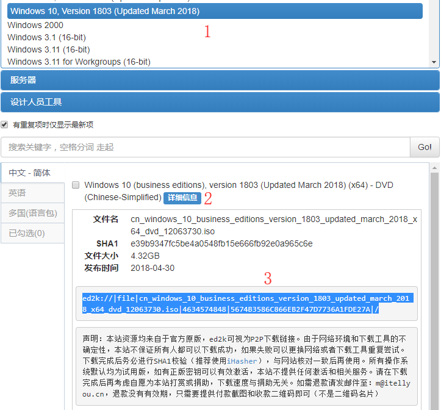
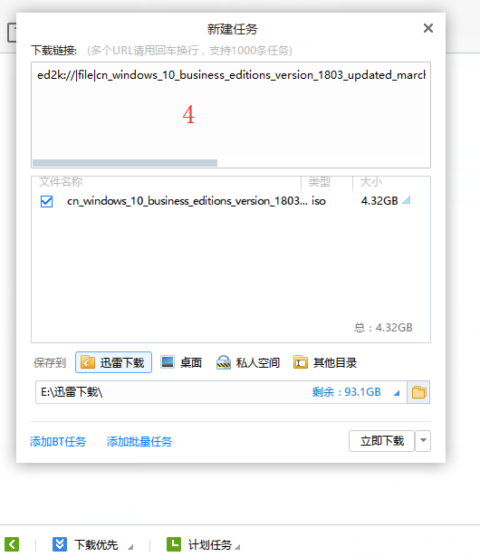
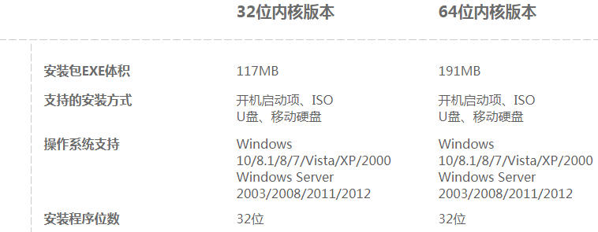

# Microsoft 系列

!!!note "简称"
    * 微软Microsoft有时简称MS（取首字母）
    * 如：msconfig(Microsoft System Configuration)、msdn(Microsoft Developer Network)

## 下载
* 推荐站点（MSDN，I tell you）：<https://msdn.itellyou.cn/>
* 需要注明的是，该网站并非微软官方，但完全免费，收费与下载无关
* 收藏夹里放放好，百度仿冒站点极多，不保证文件准确性
* 推荐下载工具（ED2K）：迅雷极速版（已停止更新，请使用安装包）

???question "为什么不使用最新版迅雷？"
    * 欢迎尝试迅雷浏览器10.0

???question "为什么不使用微软官方站点？"
    * 懒得爬墙
    * 国内速度较慢

* 
* 


## <c><del>破解</del>绿色</c>补丁

!!!tip "注意"
    * 此处仅照顾较新版本的情况

### 基本操作
* 使用：HEU_KMS_Activator_v11.2.0（或更新）
* 限定激活：批量授权版（VL）
* 官网未找到
* 实测：Win10商业版（business editions）中，无法激活

* 使用：KMSpico
* 实测：Win10商业版（business editions）中，激活为教育版
* 可能是官网：<https://kmspi.co/>

* 特例：Office2016批量授权版，在MSDN中没有

* SW_DVD5_Office_Professional_Plus_2016_W32_ChnSimp_MLF_X20-41351.iso  
* 940.74MB  
* 49D97BD1B4DFEAAA6B45E3DD3803DAC1  
```http
thunder://QUFodHRwOi8vZ2RsLmxpeGlhbi52aXAueHVubGVpLmNvbS9TVyU1RkRWRDUlNUZPZmZpY2UlNUZQcm9mZXNzaW9uYWwlNUZQbHVzJTVGMjAxNiU1RlczMiU1RkNoblNpbXAlNUZNTEYlNUZYMjAlMkQ0MTM1MSUyRUlTTz9maWQ9WmE0VVMrNUd3RmtGdCtIb0VneGdHTC9sWlc0QTZNczZBQUFBQU05OG5uZkE0UFlTYXFlbmRldXVDUW9EanNVTyZtaWQ9NjY2JnRocmVzaG9sZD0xNTAmdGlkPUE5QzUwOUJGNjI4NUMyMjFCODhCNUU2RUE5QUFDQzVDJnNyY2lkPTYmdmVybm89MSZnPUNGN0M5RTc3QzBFMEY2MTI2QUE3QTc3NUVCQUUwOTBBMDM4RUM1MEUmdWk9MTAwNDY5ODUxMyZzPTk4NjQ0MTcyOCZwaz1rdWFpY2h1YW4mYWs9ODowOjk5OTowJmU9MTQ0NDExNTQ1MyZtcz01MTIwMCZjaT0mY2s9Njc3OEZCNkM5Nzk4QjYzQzcwQjQ4ODk3QkQ5MjNGQ0UmYXQ9QTA5QjZBQjI4Q0ZCM0EzODZCRkIzOEUxQkI1NDNGNjEmaHk9MSZuPTBERTJFMUZGOTJCODNDMzA1RkZFRDBDNkJGOEQxRDVBNTBDM0Q5QzZCMzlEMEI2QzZGREZEN0NDODlCRTE0NzA3M0VFODQ5MEU3RDgyNzUyMzM4M0U5RTNCRTgwMkI2QzZEQzFFOUVEOUFBODI3NUQzMjgxOUI5NEU3REQ0RDM0MkVGOEU1RUZENkVFNzgwNTAwWlo=  
```

* SW_DVD5_Office_Professional_Plus_2016_64Bit_ChnSimp_MLF_X20-42426.ISO  
* 1123452928 B  
* MD5: 60DC8B1892F611E41140DD3631F39793  
* SHA1: AEB58DE1BC97685F8BC6BFB0A614A8EF6903E318  
* CRC32: 8D8AC6D1  
```http
ed2k://|file|SW_DVD5_Office_Professional_Plus_2016_64Bit_ChnSimp_MLF_X20-42426.ISO|1123452928|31087A00FF67D4F5B4CBF4AA07C3433B|/  
```


## Windows

| English | 翻译 |
| ------------------ |------------------- |
| Chinese-Simplified | 中文简体|
| business editions  | 商业版【企业版、教育版、专业版】（VL批量授权版）|
| consumer editions  | 消费版【家庭版、家庭单语言版、教育版、专业版、专业教育版、专业工作站版】 |
| multi-edition      | 多版本 |
| Enterprise         | 企业版 |
| Pro                | 专业版 |
| Education          | 教育版 |
| Language Pack      | 语言包 |
| VL / Vol           | 批量授权版 |
| Service Pack       | SP，服务包，大型补丁 |

## PE系统
* Windows Preinstallation Environment（Windows PE），Windows预安装环境
* 用于安装Windows，重置密码，硬盘分区等操作
* 推荐：WePE ：<http://www.wepe.com.cn/download.html> 
* 注意安装程序位数要求，即：安装64位使用64位PE
* 


