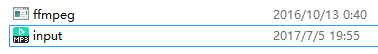
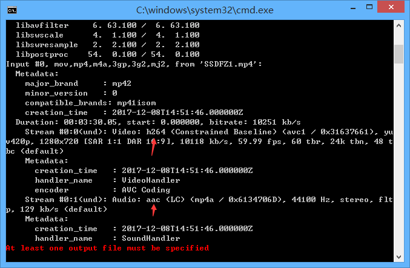
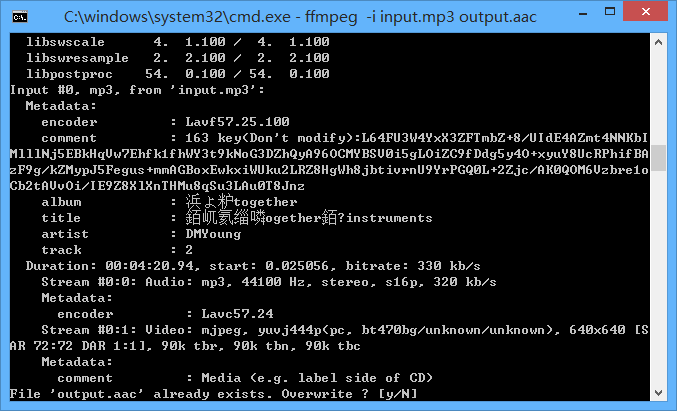
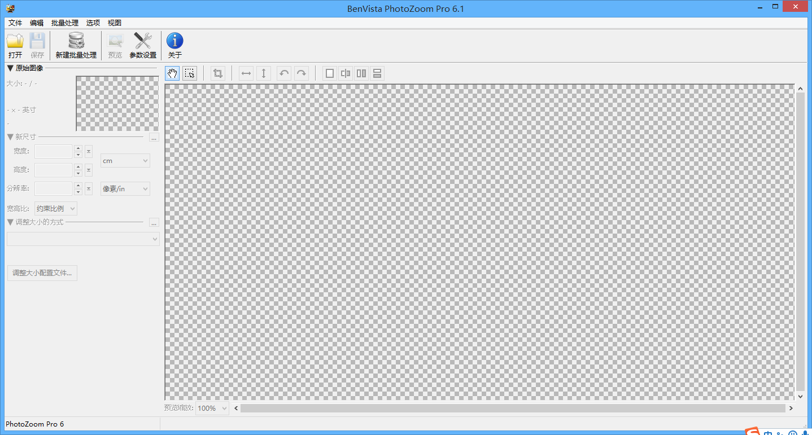
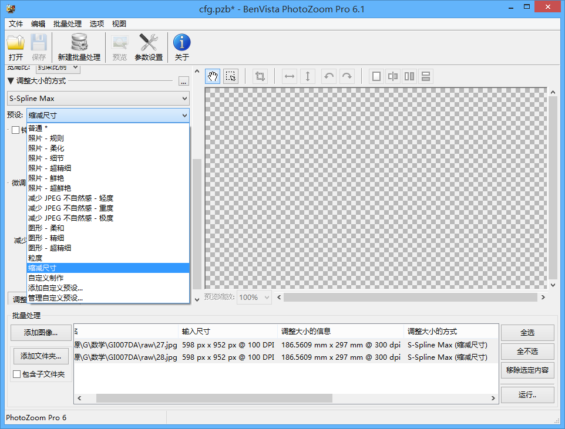
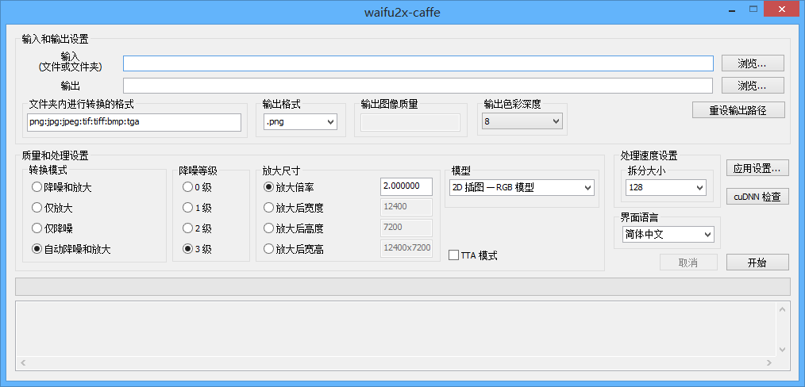

# 一些软件
## FFMPEG
* 官方网站：<http://ffmpeg.org/>
* 注意：
    * 不要下载源码  
    * 只需要ffmpeg.exe起作用
* 不想下载/找不到下载地？
    * 在JJdown Client（./OrderEXE） / m3u8批量下载器(根目录) 中有

### 正常操作（推荐）
* 将ffmpeg.exe和文件一起放到一个文件夹中（防止找不到）
* 改个方便打的名字（如果名字有空格，在两边用英文双引号括起来，如”233 666 8888.mp3”）

### 命令表
* 更多命令请百度，mp4可换成mp3，关键参数已斜体，00:00:00=时分秒：
* <http://demo.ekuai.tech/ffmpeg>
* 命令输入：在当前目录打开命令窗口（Win10如何有该选项看基本操作）

!!!warning "警告"
    * 转码之中除非要终止，不要按键盘，<c>否则你可能会想砸键盘</c>，讲不准就按到了某个查看详细信息的按钮
    * 查看详细信息会慢到你想砸电脑
    * 如果不慎按到了，还是重来吧
<pre><code>
编码转换
ffmpeg -i ***input.flv*** ***output.mp4***
视频截取
ffmpeg -ss ***00:10:00*** -t ***00:15:00*** -accurate_seek -i ***input.mp4*** -codec copy ***output.mp4***
视频合成
ffmpeg -i "concat:***input1.mp4***|***input2.mp4***|***input3.mp4***" -c copy ***output.mp4***
视频属性查看
ffmpeg -i ***input.mp4***
抽取音频
ffmpeg -i ***input.mp4*** -vn -y -acodec copy ***output.aac***
抽取视频
ffmpeg -i ***input.mp4*** -vcodec copy –an ***output.mp4***
音视频合成
ffmpeg -i ***input.mp4*** -i ***input.mp3*** -vcodec copy -acodec copy ***output.mp4***
</code></pre>

### 真·操作示例
#### 视频属性查看
* 导出注意格式（aac和mp3可以导出后转码（上方有命令））
    

#### 文件覆盖
* 如果输出文件存在，会报以下内容，输入y覆盖，输入n终止
    

## PhotoZoom
### 基本操作
* 一款图片放大<del>（马赛克处理）</del>软件，拖入图片，左上角调整图片大小，左下角调整放大算法

### 批量操作
* 先导入图片（推荐长宽比相同），全选，修改预设或配置，运行

### 推荐配置
* 普通处理（不管放大缩小），都可以选择**缩减尺寸**预设
* 根据其他的需求也可自行修改观察效果

## Waifu2X
* [网页版Waifu2X(中文)](http://waifu2x.udp.jp/index.zh-CN.html) ， [Github](https://github.com/nagadomi/waifu2x)
* [客户端Waifu2X-Caffee](https://github.com/lltcggie/waifu2x-caffe) ， [ReleaseDownload](https://github.com/lltcggie/waifu2x-caffe/releases)

!!!warning "提示"
    * 网页版只支持小于1.5k像素，最大放大倍数为2倍
    * 所以推荐使用客户端

### 客户端Waifu2X-Caffee

* 依旧使用神经网络算法计算，NVIDIA显卡可以使用CUDA计算（较快），否则只能使用CPU计算
* 请根据自己的电脑&显卡实际情况选择放大倍数（放大后宽高），推荐分多次进行放大，避免耗时且失败
* 在放大过程中不会有进度条，时间显示未知（可能只有放大文件夹会有吧），在放大完成后会显示时间
* 耐心等待，时间是分钟级别的
* 实测：放大过多会死机（显卡驱动挂掉），测试时候宽高大约1.3w会死机（画面冻结，没有蓝屏）

## 二林奇店QSV格式转换器
* QSV to flv

## Registry Workshop
* 注册表编辑器，搜索算法比系统自带的好一些

