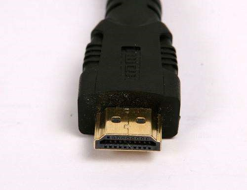
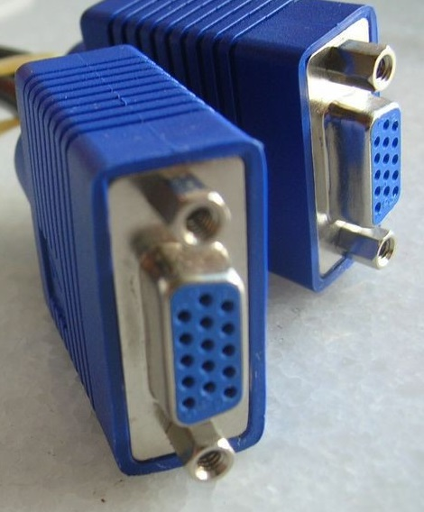
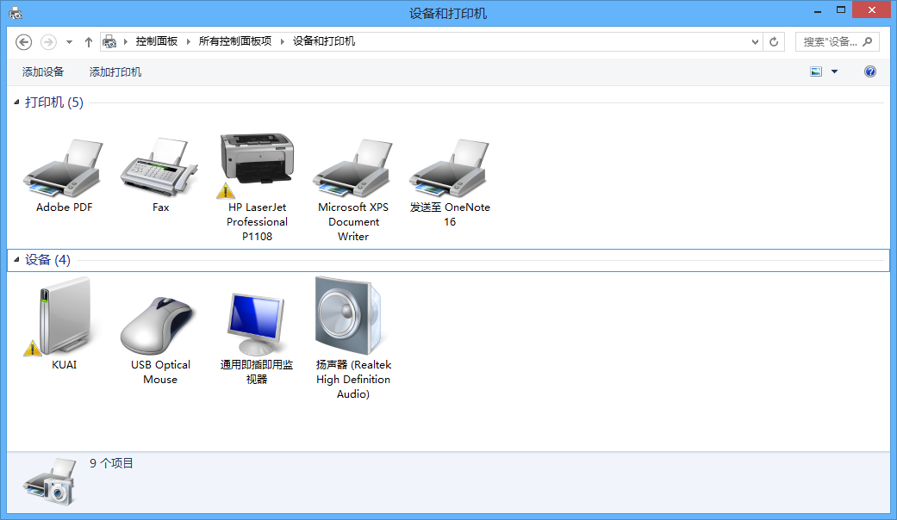
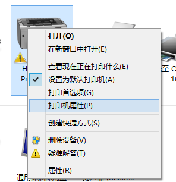
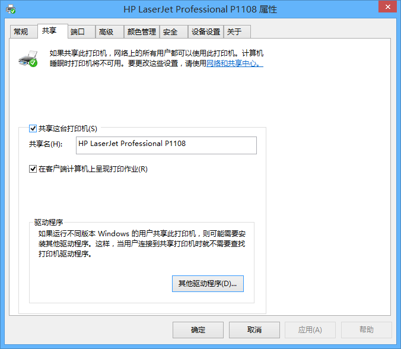
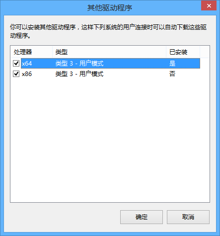
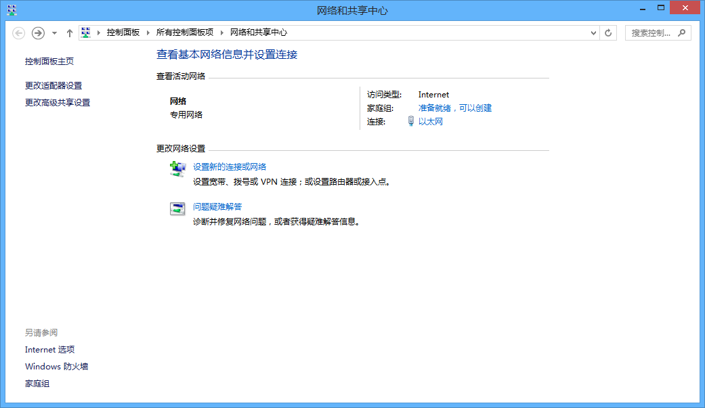
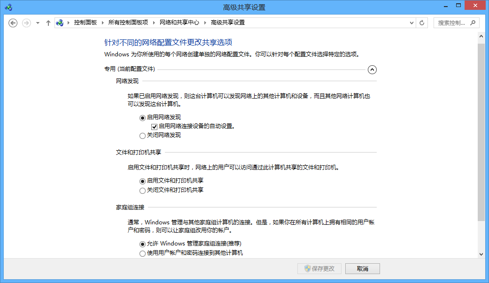
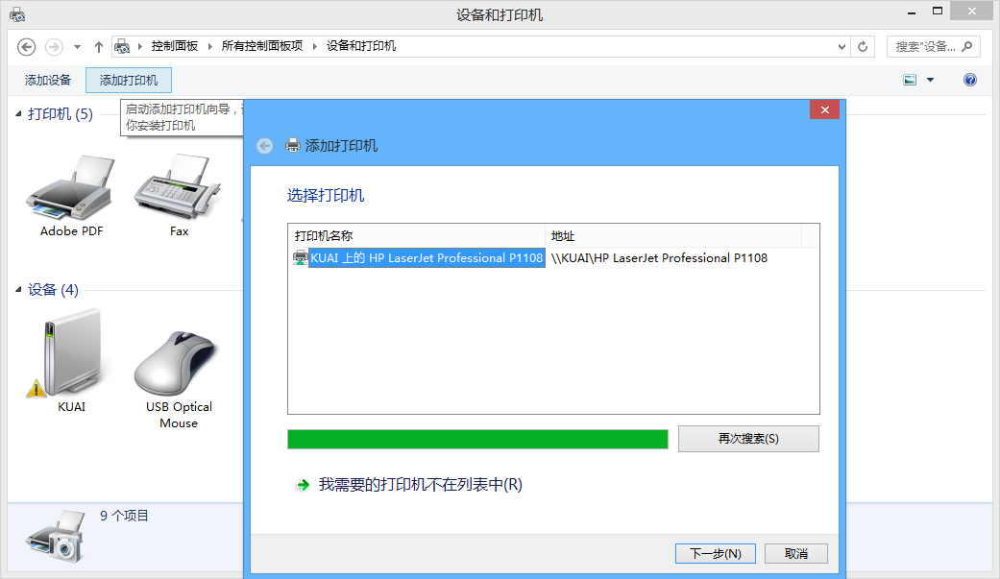

## 外接屏幕接线（VGA/HDMI）

黑HDMI蓝VGA【高一信息科技内容】
!!! warning "注意"
    颜色仅限本图，虽然VGA线大部分都是蓝头，但是不排除例外情况，主要观察形状和针头数
* 电脑包里有HDMI-VGA转接头
* 双HDMI长线很少，好像就艺体楼有一根
* VGA长线应该蛮多，如果需要可以用一跟VGA长线两头转

## VGA转接器（切换器）
* 教室电脑下面or后面蓝盒子
* 有灯指示显示方向，按按钮切换显示方向，如果电脑开着但是没有显示，可以切换一波
* 两个屏幕：小显示器，后面大屏幕（可触屏）
* 有的教室在后面（把讲台后面两扇门掰开（注意先打开插销，有个按钮按一下））
* 如果发现一个屏幕有一个没有的话注意看看是不是插反了
* 注意：该转换器要通电的，没亮灯先检查电是否插好，再看看是不是灯有问题

## 外接音频线没有声音
1.	以下内容应在彩排时解决
2.	调整音量，听有没有登的测试音
3.	W10在音量界面上面有个下拉框，选择外放设备
4.	W7/8右键音量-播放设备-设置默认设备
5.	（不确定就每个都试一下）

## 抢答器使用指南
* 详见《抢答器使用指南.docx》
* 不需要全部记住，在需要使用抢答器的时候，记得有这东西就行

## 笔记本电脑一般位置
* 小萌办公室信息楼202

## 外接屏幕分辨率不正确/黑边等
* 尝试更改显示器的分辨率到合适的比例，但是需要注意的是，需要注意显示器的最大分辨率限制
* 以上尝试无效可能是投影仪偏误，或输出设备限制

## 双面打印
### 自动双面打印
* 真·自动双面打印

### 手动双面打印
* 翻转长边：左右翻页（装订线在长边）
* 翻转短边：上下翻页（装订线在短边）
* 如果不确定，可以先印一张出来看看

## 打印机共享

!!!note "用途"
    * 用于局域网内不同机器共享打印机
    
!!!abstract "重点"
    * 先需下载好对应打印机的驱动程序
    * 需要x86，x64驱动都安装
    * 需要设置允许进行网络发现

1. 准备：主机连接好打印机，安装好打印机驱动，测试打印机可用，确保几台电脑在同一局域网之中
2. 推荐在主机同时安装好x86和x64的打印机驱动（其他机器会从主机获取驱动）
3. 开始操作，主机打开设备和打印机，右键打印机，打印机属性
    
    
4. 勾选共享这台打印机
    
5. 点击其他驱动程序，将x86，x64均勾选，并按照后续提示进行安装驱动
    
6. 主机和客机均要进行该设置：打开网络和共享中心，点击更改高级共享设置，选择启动网络发现，启动文件和打印机共享，允许账户连接
    
    
7. 客机打开设备和打印机，点击添加打印机，按后续提示进行操作
    

