## Powerpoint音频播放限定张数停止
1.	调出动画窗格（动画-动画窗格（添加动画旁边））
2.	右键动画窗格中音频，效果选项，停止播放，在X张幻灯片后

## 刷新:F5 & Ctrl+F5
* 一下内容针对于浏览器
* 刷新快捷键：F5（普通刷新，部分数据从缓存中获取）
* Ctrl+F5：强制刷新，所有内容重新从服务器获取，一般用于解决本地缓存出错或服务器缓存更新的情况
* Eg：电视信息课那个网页，如果打开视频是黑的，用Ctrl+F5刷新即可

## 截图相关
### 视频截图
* 正式使用时拒绝QQ截图
* 以PotPlayer播放器为例
* 打开视频，找好位置暂停，按照软件进行操作，截出的图片与原视频大小（分辨率）相同
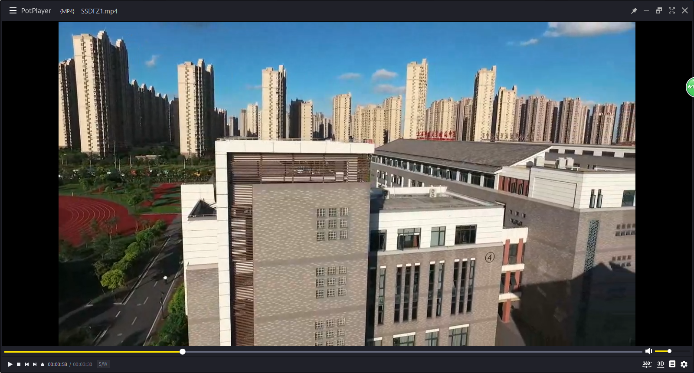
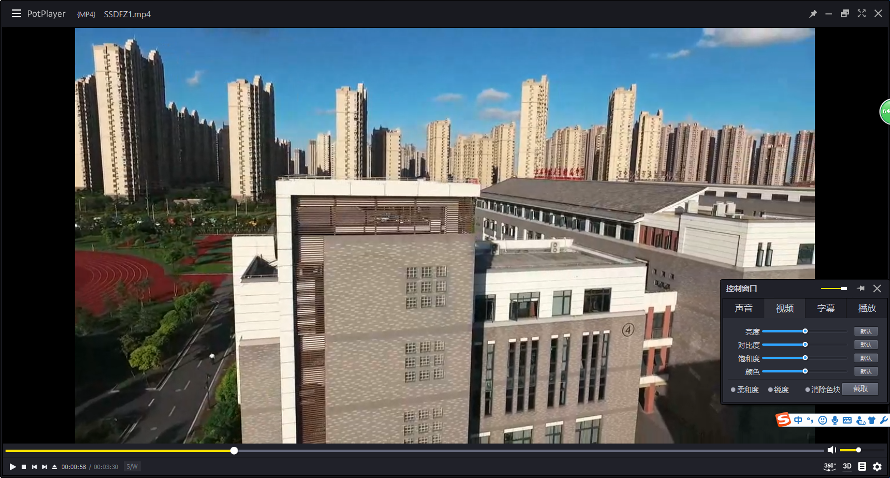
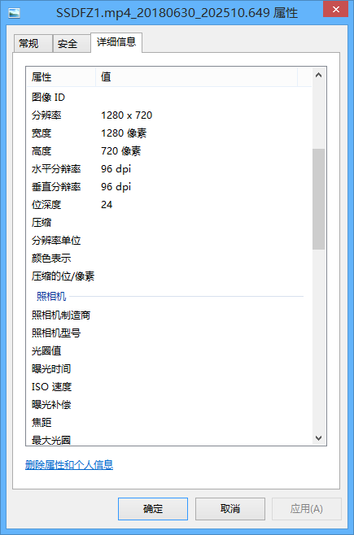

### 普通截图
* 比尔·盖茨给你的截图键：Win附件中
* 键盘上Print Screen（Prt Scr），整个屏幕内容将会进入剪辑板，使用画图变成文件，或直接粘贴皆可

### 预览截图
* 不追求画质，QQ截图即可，方便快捷
* 需启动着QQ，快捷键`Ctrl + Alt + A`

## 在此处目录打开命令窗口
### 普通操作
* `#!js Shift + 右键`窗口会出现（不能选中文件）
* 与打开cmd，`#!js cd 目录` 相同

### Win10操作
* Win10系统中由于在此处打开命令窗口被替换为了PowerShell，如果需要使用，按以下步骤操作
* 复制以下内容至文本文档，重命名另存为.reg文件，双击运行该文件以导入
```js
Windows Registry Editor Version 5.00
[HKEY_CLASSES_ROOT\Directory\shell\OpenCmdHere]
@="在此处打开命令提示符"
"Icon"="cmd.exe"
[HKEY_CLASSES_ROOT\Directory\shell\OpenCmdHere\command]
@="PowerShell -windowstyle hidden -Command \"Start-Process cmd.exe -ArgumentList '/s,/k, pushd,%V' -Verb RunAs\""
[HKEY_CLASSES_ROOT\Directory\Background\shell\OpenCmdHere]
@="在此处打开命令窗口"
"Icon"="cmd.exe"
[HKEY_CLASSES_ROOT\Directory\Background\shell\OpenCmdHere\command]
@="PowerShell -windowstyle hidden -Command \"Start-Process cmd.exe -ArgumentList '/s,/k, pushd,%V' -Verb RunAs\""
[HKEY_CLASSES_ROOT\Drive\shell\OpenCmdHere]
@="在此处打开命令窗口"
"Icon"="cmd.exe"
[HKEY_CLASSES_ROOT\Drive\shell\OpenCmdHere\command]
@="PowerShell -windowstyle hidden -Command \"Start-Process cmd.exe -ArgumentList '/s,/k, pushd,%V' -Verb RunAs\""
[HKEY_CLASSES_ROOT\LibraryFolder\background\shell\OpenCmdHere]
@="在此处打开命令窗口"
"Icon"="cmd.exe"
[HKEY_CLASSES_ROOT\LibraryFolder\background\shell\OpenCmdHere\command]
@="PowerShell -windowstyle hidden -Command \"Start-Process cmd.exe -ArgumentList '/s,/k, pushd,%V' -Verb RunAs\""
```

### 逼格操作
1. 打开命令行： `#!js Win + X` - 命令提示符  或   `#!js Win + R` - `#!js cmd`
2. 进入目录： `#!js cd 目录`  - Eg:`#!js cd C:/`
    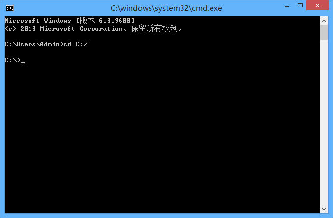

!!!tip "提示"
    * 若目录中含有空格，则在目录参数两端添加引号（英文）`""`
    * Eg:`#!js cd "C:\Program Files\"`
    
!!!note "提示"
    命令行目录数据不区分`\`和`/`

## 扩展名/后缀名相关
### 显示
* 较高版本的系统是默认不显示后缀名的
* 需要显示，按以下方法操作
* 资源管理器 - 查看（上方菜单） - 勾选文件扩展名（显示/隐藏）
    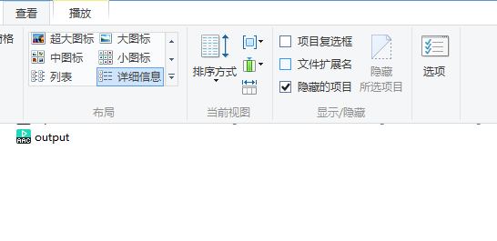

### 修改
1.	显示扩展名后使用重命名直接更改，会提示确认，点是即可
    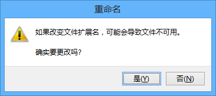

!!!Warning "警告"
    虽然有时更改扩展名之后仍然可以读出源文件（正常文件），如音频文件、图片文件，但是仍然推荐根据文件格式命名
2.	Reg，Bat等本身就是文本的可以使用文本文档进行编辑，使用另存为-所有格式*.*，手动输入扩展名
    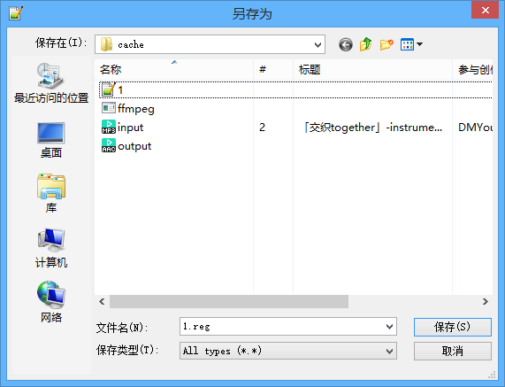

## 32位系统剪辑音(视)频（Expired Adobe/PPT/ffmpeg）

!!!success "Excellent"
    非常好，现在团委有一台64位电脑了，可以使用Au 2018剪辑音频
### Expired Adobe
* 使用Adobe CS 可以在32位系统中运行

### PPT
* 原理：2012+的PowerPoint提供了音、视频的保存功能，利用该功能进行操作
* 操作步骤：插入音频，选择裁减范围、淡化，然后进行保存
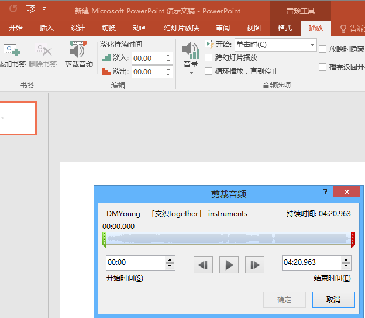
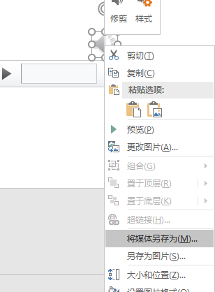

### ffmpeg
* 关于ffmpeg的详细内容：见ffmpeg相关
* 剪辑操作
```js
ffmpeg -ss 00:10:00 -t 00:15:00 -accurate_seek -i input.mp4 -codec copy cut.mp4
```
```js
ffmpeg -ss 开始时间（时:分:秒） -t 结束时间 -accurate_seek -i 输入文件(可以mp3) -codec copy 输出文件(与输入文件格式相同)
```

## 录屏
* 使用：[BiliBili直播姬](https://live.bilibili.com/liveHime)
* 方案仅供参考
* 录屏直播-选择显示器-不用啦-抓屏-显示器/窗口，也可以加入文本图片等
    
    
    
* 点击确定后加入的场景会在右边显示，可以直接点左边屏幕上的选中，也可以点右边列表选中，选中后可以上下移动（按钮），删除（delete）或是切换显示（场景列表前面的眼睛）
    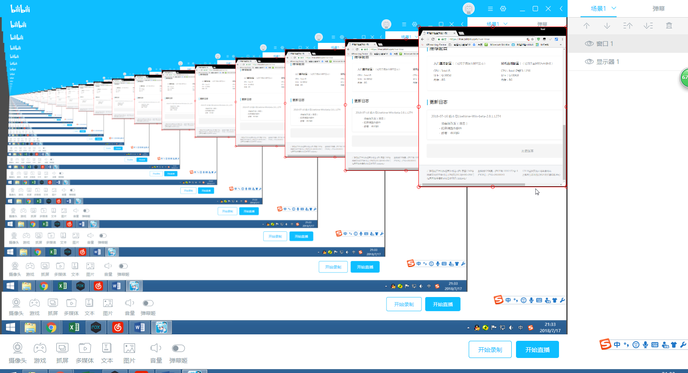
* 设置界面（头像右边）可以调整分辨率等信息
    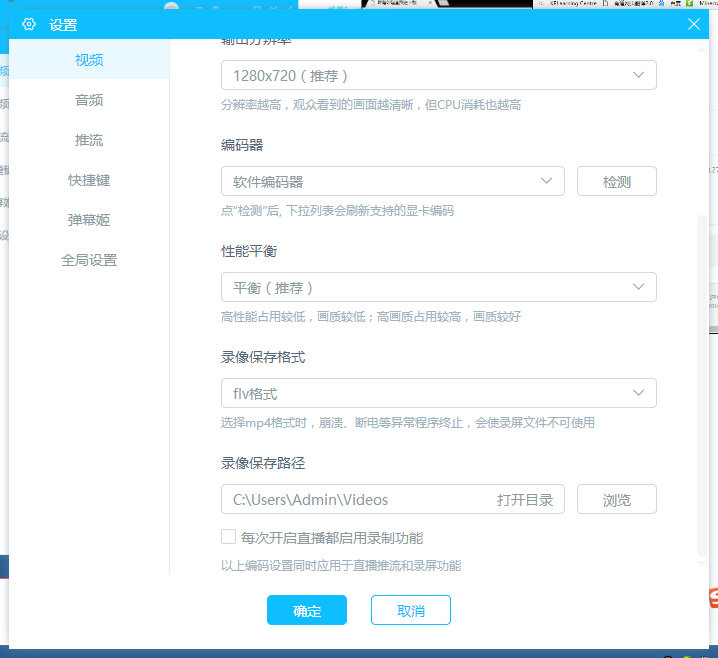
* 准备就绪后单击开始录制，录制完成后会生成flv文件，生成在上方录像保存路径位置
    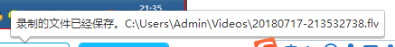
* Flv文件后续转码，剪辑等操作，见ffmpeg篇

## B站视频下载相关
* 使用[jjDown](https://www.jijidown.com/)

### 网页版（不推荐）
* <http://www.jijidown.com/> 或 <http://www.bilibilijj.com/>
* 如何打开：在b站.com前面加个jj
* 如：<https://www.bilibili.com/video/av26829036> 变成 <https://www.bilibilijj.com/video/av26829036> ，回车打开即可
    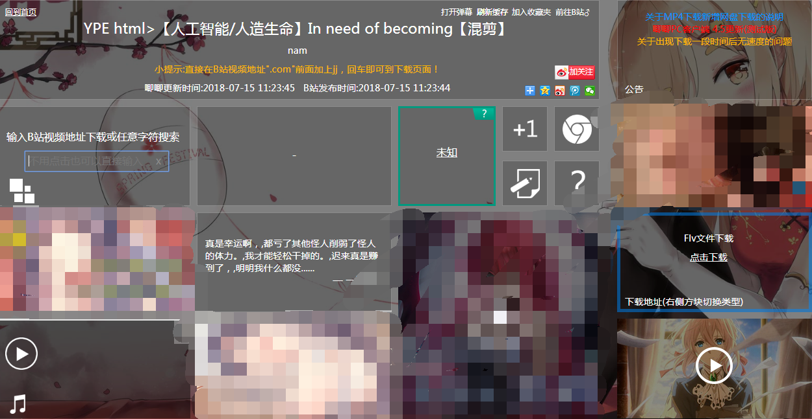
* Flv文件是有直接下载的（使用B站源），Mp3和Mp4么….看脸（原理：JJ服务器转码），如果要下一个很新/很少人看的视频
    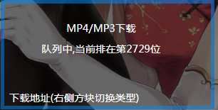
* 这还是在大半夜，曾经有过几W名的，所以推荐客户端

### 客户端（推荐）
* [JJDownForWPF](http://client.jijidown.com/)
* 高版本系统不需要去关注神奇的运行环境，不过如果你XP的话还是要装.net的
* 正常使用：
* 打不开请安装：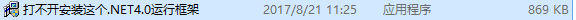
* 还是打不开使用：
* 还是打不开进[官方BUG群](点击链接加入群聊【唧唧PC客户端BUG中心 - 3】：https://jq.qq.com/?_wv=1027&k=53AQgkG)反馈
* 你可以复制B站视频链接或是Av号（Ep等也可）至主页面输入框，在JJDown启动情况下，会自动检测剪辑板并在任务栏提示

!!!example "URL自动加载"
    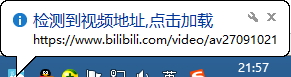
    
     
    
* 点击URL自动加载气泡，或手动输入URL
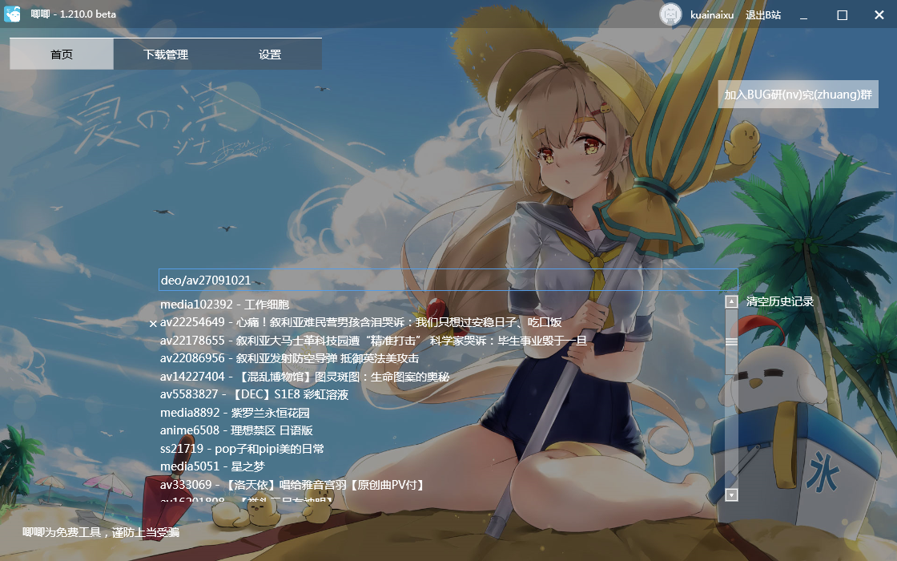
* 回车即可跳转到相应页面，页面中下载：超清：720p，标清：480p
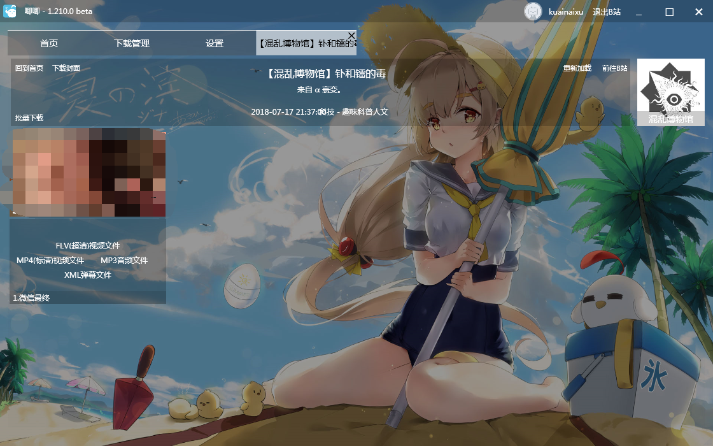
* 1080p：使用批量下载（左边）

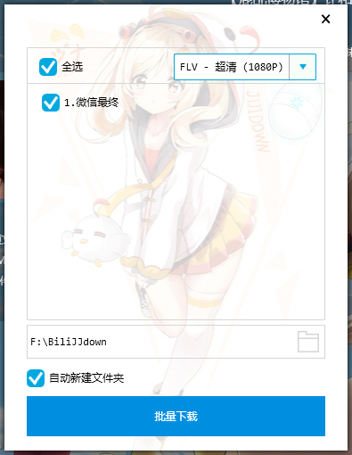

* FLV在设置中调整，即可自动转码MP4
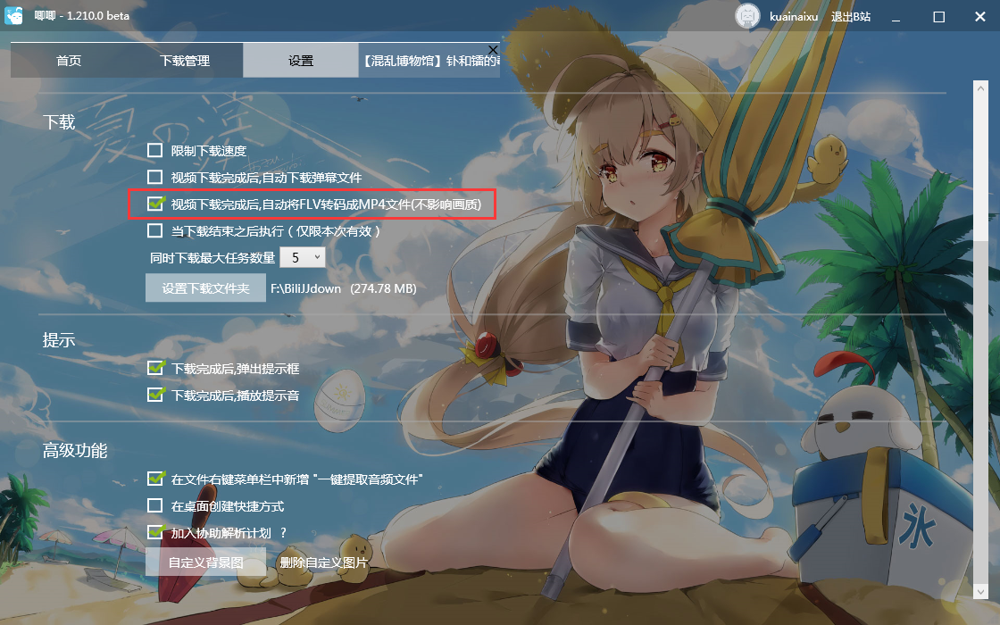

* 弹幕下载：XML弹幕下载后会自动变成Ass字幕文件，和同名视频放在同一文件夹，播放视频即可同步播放
* 若Ass播放很卡，请使用BiliLocal 或 [弹弹Play](http://www.dandanplay.com/)等专业XML弹幕播放软件
* 若XML弹幕播放软件有双倍弹幕，请删除Ass文件

!!!info "提示"
    * MP3文件下载原理：下载FLV视频文件，转码成为MP3
    * 所以下载MP3速度与下载MP4速度差不多
* 搜索：在首页编辑框中直接进行搜索，会跳出B站搜索界面，点击标题获取视频信息，点击后看到右下角创建完毕后即可关闭搜索界面（不会自动关闭，可以一次创建多个）


!!!tip "提示"
    部分番剧/视频/高清版需要登陆/大会员权限才可下载（观看），点击右上角即可登录

### 你可能需要的UP
* 哔哩小红旗：<https://space.bilibili.com/86335477/#/>
* 共青团中央：<https://space.bilibili.com/20165629/#/>

### 你可能会需要的几个视频
* SSDFZ优酷账号（润梦）：<http://i.youku.com/u/UMTc0ODkwMzI4OA==>
* 邂逅（航拍2016）（朱序）（有高清不用去下）：<https://www.bilibili.com/video/av6073206> 
* 邂逅（延时2018）（李加西）（有高清不用去下）：<https://www.bilibili.com/video/av25369386> 
* 团歌（PV）（前半合唱，后半伴奏，可以剪辑操作一下）<https://www.bilibili.com/video/av25332398> 

## 一些图片格式
### TIF(F)
* 无损压缩，可以保存需要图层的图片，但是不推荐
* 可以保存透明度

!!!tip "提示"
    * 在Ps中保存TIF时会显示确认框，如需保存透明度需手动勾选
    * 推荐选择：LZW、存储透明度、扔掉图层并存储拷贝（其余保持默认）
    * 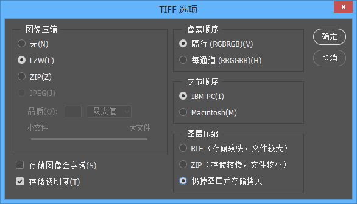
!!!quote "LZW"
    * 蓝波-立夫-卫曲编码法（Lempel-Ziv-Welch，缩写LZW），是亚伯拉罕·蓝波（英语：Abraham Lempel）、杰可布·立夫（英语：Jacob Ziv）与泰瑞·卫曲（英语：Terry Welch）共同提出的一种无损数据压缩算法。
    * 别名串表压缩算法
    * 通过建立一个字符串表，用较短的代码来表示较长的字符串来实现压缩。
    * 无损压缩

### PNG
* 无损压缩，保存透明度图片推荐

### JP(E)G
* 有损压缩，可以设置图片质量，根据需求进行设置

### PSD
* PS工程文件，大小根据嵌入内容而定
  
### PSB
* PS大型工程文件，用于存PSD存不下的文件（但是只有PS可以读取）
* 支持宽度或高度最大为 300,000 像素

## 压缩相关内容
* 压缩：一种通过特定的算法来减小计算机文件大小的机制
* 分：
    * 可直接读（html文件、js文件）（本质：文本文件）【删除空格、回车等不必要的标记符】
    * 不可直接读（ZIP、RAR）【使用压缩算法，必须要相应的压缩软件】

### 分卷压缩
* 将一个压缩文件进行拆分成几份，压缩卷缺一不可
* 后缀名根据压缩软件不同而不同，目前发现有.01.zip和zip.01这种格式
* 现在压缩软件很通用，无需担心

!!!note "运用：简单的文件加密"
    1. 将源文件进行分卷压缩
    2. 删除源文件，带走一份或多份压缩卷（即：移动硬盘保存一个分卷，本地磁盘保存其余分卷）
    3. 需要文件时，将移动硬盘中分卷复制至本地，解压即可
    4. 原理：分卷压缩缺卷无法解压

### 压缩文件损坏
* 在各种神奇的下载过程之中（如百度云多线程下载、IDM拼接文件出错），压缩文件可能会损坏
* 可能有两种情况：
    1. 文件写入顺序错误（正常错误，有救的）   
    2. 文件下载出错（某一分块下载了两份，某一分块没有下载，没救了，重新下）
* 我们针对1进行处理（方法二选一）【当然你在处理之前不能判定是哪种情况】
    1.	WINRAR处理
        * 下载[WinRAR压缩](http://www.winrar.com.cn/)
        * 打开压缩包，点击工具-修复压缩文件（`#!js Alt + R`）
        * 软件会进行处理，并且生成rebuilt文件，进行解压即可
    2.	Proxyee Down自带
        * 如果你装了，可以直接用
        * 如果没装，请看方法a，毕竟Winrar小得多

## SysWOW64
* 在Windows64位系统上有，C:\Windows\SysWOW64
* 目的：为了在64位系统上运行32位的软件

## API
* API（Application Programming Interface,应用程序编程接口）是一些预先定义的函数，目的是提供应用程序与开发人员基于某软件或硬件得以访问一组例程的能力，而又无需访问源码，或理解内部工作机制的细节。
* 可以是：网页，DLL，模块，文件包，exe等形式

### RESTful API
* [Origin(REST-WikiPedia)](https://zh.wikipedia.org/wiki/%E8%A1%A8%E7%8E%B0%E5%B1%82%E7%8A%B6%E6%80%81%E8%BD%AC%E6%8D%A2)

!!!quote "REST"
	* 表现层状态转换（英语：Representational State Transfer，缩写：REST）
        1. 以资源为基础
            * 每个资源都可以通过URI访问到。
            * 也就是一个个可以认知的资源，比如文档，音乐，视频等信息，都可以通过唯一的URI确定
        2. 通过重表达的客户端可以管理原资源
            * 就是我们通过客户端可以修改原资源的状态
        3. 返回信息足够描述自己
            * 这样重表达的客户端可以知道如何处理

!!!quote "RESTful API"
    * 匹配REST设计风格的Web API称为RESTful API。
    * 它从以下三个方面资源进行定义：
      	* 直观简短的资源地址：URI，比如：`#!js https://example.com/resources/`
        * 传输的资源：Web服务接受与返回的互联网媒体类型，比如：JSON，XML，YAML等。
        * 对资源的操作：Web服务在该资源上所支持的一系列请求方法（比如：POST，GET，PUT或DELETE）。
    * 下表列出了在实现RESTful API时HTTP请求方法的典型用途。
    
        | 资源 | GET | PUT | POST | DELETE |
        | ---- | --- | --- | ---- | ------ |
        | 一组资源的URI，比如`#!js https://example.com/resources/`    | **列出**URI，以及该资源组中每个资源的详细信息（后者可选）。  | 使用给定的一组资源**替换**当前整组资源。              | 在本组资源中**创建/追加**一个新的资源。该操作往往返回新资源的URL。 | **删除**整组资源。   |
        | 单个资源的URI，比如`#!js https://example.com/resources/142` | **获取**指定的资源的详细信息，格式可以自选一个合适的网络媒体类型（比如：XML、JSON等） | **替换/创建**指定的资源。并将其追加到相应的资源组中。 | 把指定的资源当做一个资源组，并在其下**创建/追加**一个新的元素，使其隶属于当前资源。 | **删除**指定的元素。 |

!!!example "示例"
    * 例如，一个简单的网络商店应用，列举所有商品
    
        `#!http GET http://www.store.com/products`
        
    * 呈现某一件商品
    
        `#!http GET http://www.store.com/products/12345`
        
    * 下单购买
    
         `#!http POST http://www.store.com/orders`
         
         `#!html <order>...</order>`

## DLL
* DLL(Dynamic Link Library)文件为动态链接库文件，又称“应用程序拓展”
* Windows系统中就有很多DLL文件，位于：C:\Windows\System32  和  C:\Windows\SysWOW64（64位限定）
* 在应用程序当前目录下也可以放所需的dll文件，系统会自动进行调用（放到system也可以调用）
* 在使用应用程序的时候，如果提示缺少DLL，可以获取放入系统中或是软件运行目录下

## 图片处理相关
### 抗锯齿(伪高清)
* 使用软件 PhotoZoom ，详见 PhotoZoom 篇

!!!warning "提示"
    * 本方法无法将图片清晰度调高，只是去除颗粒，所以最好还是拍摄时候取出高清图片

### 细节化处理
* 使用Waifu2X ， 详见 Waifu2X 篇
* [网页版Waifu2X(中文)](http://waifu2x.udp.jp/index.zh-CN.html) ， [Github](https://github.com/nagadomi/waifu2x)
* [客户端Waifu2X-Caffee](https://github.com/lltcggie/waifu2x-caffe) ， [ReleaseDownload](https://github.com/lltcggie/waifu2x-caffe/releases)

!!!tip "提示"
    * Waifu2X 使用卷积神经网络对动漫风格的图片进行放大处理，效果比普通放大好

### 位图与矢量图
#### 位图
* 由像素点组成，不需要专用的软件打开，文件大小较大，放大失真

#### 矢量图
* 由曲线（函数）组成，可以填充颜色，需要专用软件打开，文件较小，放大不会失真

### 关于分辨率（仅限位图）
* 分辨率分：【名字记着方便，看怎么理解】
    * 显示分辨率（像素数）：总的像素点数，一般是长×宽
    * 图像分辨率（每英寸像素数dpi）：单位面积上的像素点数，一般是像素/英寸（面积需要平方）
* 在普通显示不需要关注，用于印刷时需要关注，一般是（PS）设置长宽（cm或mm）和分辨率（dpi），PS会自动运算出显示分辨率
* 图像分辨率越大，越清晰（单位面积像素点多）
* 对于有损压缩（如JPEG），还有一个清晰度参数（PS保存即可看到）越大越清晰，具体区别自己尝试，保存后放大观察
* 位深度：颜色数量，如24位就是2^24种颜色，也有32位或者更高的，但是24位比较通用
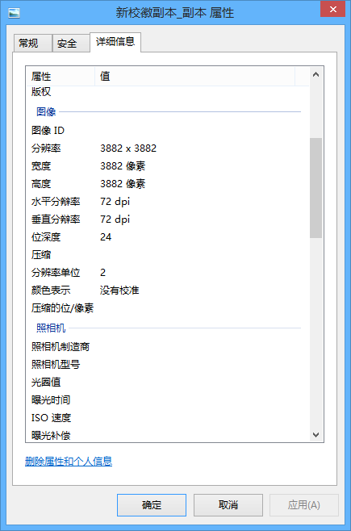

## 视频相关
### 视频数据
* 视频组成：由快速变换的图片组成，如24帧则为每秒显示24张图片，即图片切换时间为1/24=0.04167秒
* 帧宽度、高度是显示时候的参数（同图片），不过不说一定，毕竟放大缩小不是放着玩的
* 帧速率（fps），每秒图片数量，一般电视24帧，视频24/25/30/60帧，，空间视频10帧，游戏帧数看设定，电影甚至可以达到120帧（《比利·林恩的中场战事》）
* 数据比特率，每秒钟显示的数据大小，比特率越高，越清晰（如：b站是2000kbps）
* 注意：单位是bps（位每秒），换算到B（比特）需要除8
* 一般来说，比特率为：帧数 × 帧宽 × 帧高 × 颜色位数  单位bps（二进制位每秒）
* 颜色位数：一般是24位（24b（3B）每像素）
* 视频压缩算法：一般是省略与上一张图片相同的像素
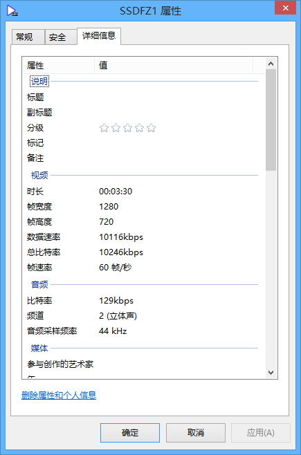

### M3U8

!!!note "提示"
    M3U8文件本质上是一个文本文件，可以使用文本文档、Notepad等打开

1. 根目录文件（也可能直接是下面那种，请往下看）
    * <http://devimages.apple.com/iphone/samples/bipbop/bipbopall.m3u8> 
        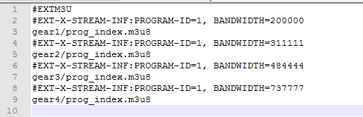
    * 四个.m3u8文件是真实目录，但是没有主页网址，所以需要手动拼接
2. 列表文件：是gear直接开头，所以直接将文件名替换成后文
    * <http://devimages.apple.com/iphone/samples/bipbop/gear1/prog_index.m3u8> 
        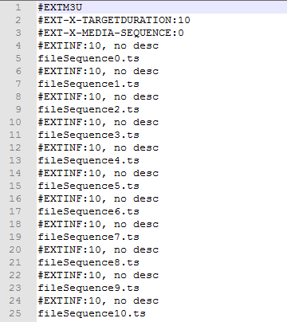
    * 可以看到一堆.ts文件，这就是整个视频拆分内容，只需要下载下来并拼接即可
    * 但是那样会死人的，我们需要脚本
3. 下载操作
    * 操作1：直接加入链接（<http://devimages.apple.com/iphone/samples/bipbop/gear1/prog_index.m3u8>）
        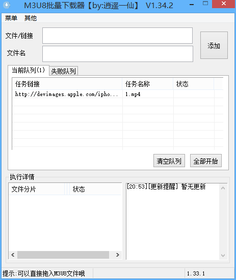
    * 操作2：在ts文件前面加入网址（替换功能）
        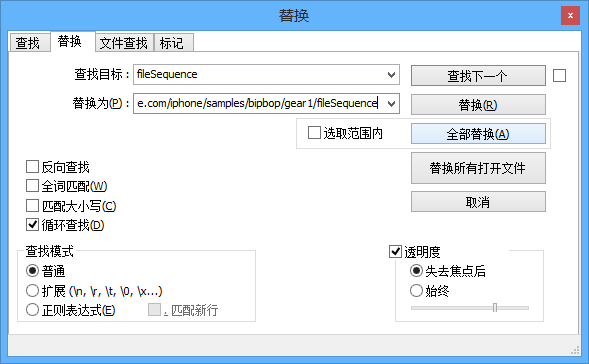
        * 点全部替换（但是只能点一次，否则可以试试看）
    * 另一种格式：<http://demo.example.com/233/666/888.m3u8> 
        * 注意前面多了个/
        * 则需要下载：<http://demo.example.com/gear1/prog_index.m3u8>
            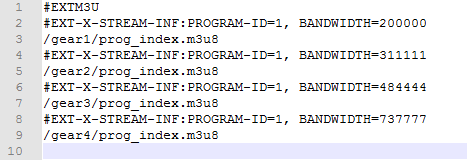
        * 如果前面有http，直接下载即可


## 音频相关
### 音频数据
* 采样频率：每秒采样点数（单位Hz）44.1k = 44100，具体看高一信息科技上册或百度
* 比特率：采样频率 × 采样位数 × 声道数  单位bps（二进制位每秒）
* 采样位数（量化位数），百度或信息科技
* 声道数：一般单声道和双声道，左右耳不同就是双声道的操作，但是一般没有左右耳也是双声道（两个声道内容相同）


## 文档印刷
* 文档印刷时候有时候多了一两行，可以调小页边距挤到一张纸
* 页边距：文件-打印-页边距  或  布局-页边距

## 字体
### 字体图片找字体
* 识别字体<http://www.likefont.com/>，具体使用方法详见网站
* 图片是位图，文本（字体）是矢量图
* 在ppt或者印刷品上最好不要使用图片字体
* 图片的话放大会失真，不便于印刷

### 英文字体：Typekit及其处理
* Adobe 的字体网站 <https://typekit.com/> 
* 红框内输入文本，如可以下载字体更好，不能下载只能放大进行网页截图（详见截图）然后抠掉白色
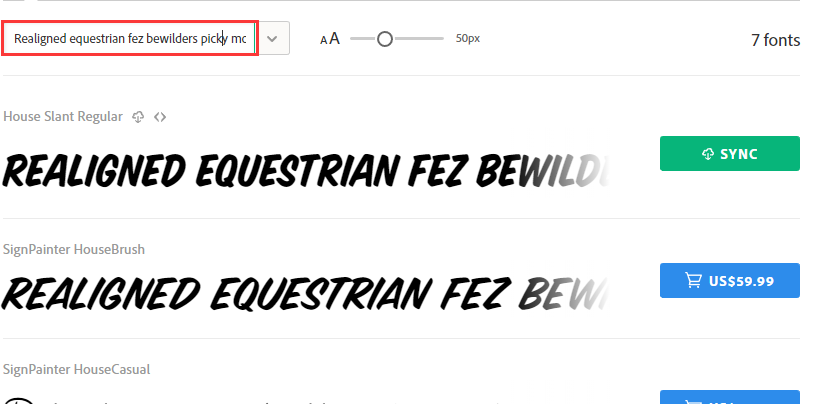

## /和*和^在数学表达式
* 作为数学表达式时，/ = ÷，* = ×，^ = 次方（^0.5 = 开根号，^(1/3) = 开立方，以此类推）

## 关于360

!!!note "提示"
    * 各种软件效果因人而异，看个人喜好和习惯，以下仅列出一点可能会出问题的点

### 漏洞修复
* 安装系统时，最好安装以及打过补丁的系统，因为中国墙很厉害，更新可能一天也更不完
* 如果有很多的漏洞需要修复，那还是放弃吧，不保证哪个就需要联网更新，更新系统更新不完是无法开机的，中途中断又保不准会出什么事情

### 易语言报毒
* 易语言程序并非所有软件都会报毒，只是某些敏感操作容易报毒
* 所以有人说“软件是易语言写的，不要管报毒”，请认真辨别软件真伪

!!!warning "警告"
    * 并非未报毒的软件就无毒
    * 举个栗子：某软件在桌面写入大量单个文件（极小文件，不会占很多存储空间，但是会很卡，具体原因百度或见文件存储相关），会造成系统开机卡死（加载桌面文件）等其他问题
    * 上面栗子是真实事件，具体为Anti-anti-cheat.jar

### 隔离沙箱
* 可以作为一个低级版的虚拟机使用，不确定安全的软件可以使用沙箱运行
* 但是仍然不一定安全，最好还是使用真·虚拟机

### 软件管家
* 不推荐使用软件管家安装软件
* 但是一些神奇的一些运行库，网上下载不到的可以安装一下，如微软运行库合集等

### 到底要不要安装
* 如果不太能辨别软件真伪的话（真·小白）还是装一下吧

## 关于百度

!!!note "提示"
    * 各种软件效果因人而异，看个人喜好和习惯，以下仅列出一点可能会出问题的点

### 搜索注意
* 某些V标识和广告标识，虽然很小但是要注意

### 限定条件搜索 / 高级搜索 / SEO搜索
* 以百度为例
* 百度高级搜索语法（详细版）：<https://www.zhihu.com/question/23622803>，<https://jingyan.baidu.com/article/2a138328488be7074a134f15.html>
* 百度高级搜索集成页面：<https://www.baidu.com/gaoji/advanced.html>
* 根据测试，引号`“”`、冒号`：`，不区分
* 常用内容
    * 引号：将引号内文本将作为一字符进行搜索（不拆分）
        
        
    * site：限定搜索内容的地址
        

### 百家号
* 百(ying)家(xiao)号

### 脚本
* Tampermonkey脚本：[AC-baidu:重定向优化百度搜狗谷歌搜索_去广告_favicon_双列](https://greasyfork.org/zh-CN/scripts/14178-ac-baidu-%E9%87%8D%E5%AE%9A%E5%90%91%E4%BC%98%E5%8C%96%E7%99%BE%E5%BA%A6%E6%90%9C%E7%8B%97%E8%B0%B7%E6%AD%8C%E6%90%9C%E7%B4%A2-%E5%8E%BB%E5%B9%BF%E5%91%8A-favicon-%E5%8F%8C%E5%88%97)
* 主要：去重定向、去除广告、去除百家号

## 镜像文件的装载（ISO）
* Win8+：自带虚拟光驱（但是仅限ISO），默认双击打开即可，如果文件关联有问题，可以右击使用文件管理器打开
* Win7-：直接解压或下载虚拟光驱软件，如Daemon Tools lite、Ultra ISO 等

## 关于Insert
* 有时候你会发现输入在文本中间的字时，他会将后面的一个字覆盖掉
* 那就可能是你不小心按下了Inset按键（一般位于主键盘右边，方向键上方，和Pageup/down在一起的）
* 在Word和其他一般软件中，不会有区别，所以看不出来
* 在VB或是codemirror之类专业编辑或编程软件会有显示
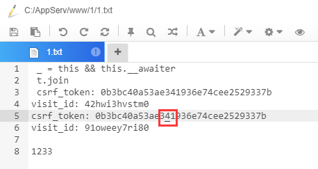

## 图标（ICON）
* 推荐：阿里巴巴式量图标库<http://www.iconfont.cn/> 
* 中间蓝条条点进去搜索
* 注册个Github账号，登陆
* 鼠标放在图标上，最下方下载，可手动输入大小（改很大可能下载失败），修改颜色
* 选择分辨率，也可手动输入
* PS、AE用可下载矢量图（EPS）
* 普通使用下载位图即可
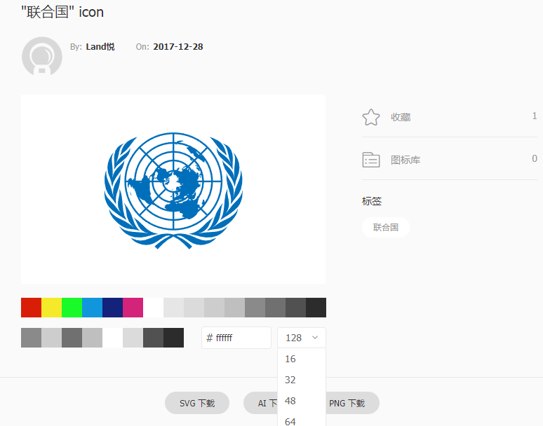

## 一些单位简称和转换
### 普通单位
* 1,000 = 1K(kilo)
* 1,000,000 = 1,000K = 1M(million)
* 1,000,000,000 = 1,000M = 1B(billion)
* 1,000,000,000,000 = 1,000B = 1T(trillion)
* 科学计数法：2.33e6=2.33*10^6

### 计算机单位
* 8b（bit二进制位数）=1B（Byte比特）
* 1KB=1024B，1MB=1024K（有时B默认不写，文件大小时默认为B），1G=1024M，1T=1024G
* 1Kbps（位每秒）=1024bps，1Mbps=1024Kbps，往后类推，bps一般用作传输速度单位（网络带宽）
* 特殊计算：U盘的大小计算是按1000来算的，但是在电脑仍然按1024显示，所以显示比标注的会少一些

## 文件/字符编码
* 比较常见的用UTF8（多国语言）、GBK（中文）、ASCII（英文）
* 普通文件推荐使用UTF8编码
* GBK为统称，有GB2312、GB18030等等
* ANSI，根据系统国家和地区扩展的英文编码，如中国即为GBK

## 进制
* 平时运算为十进制（0-9），计算机内部运算为二进制（0-1），原因：二进制的加减可以以与或运算的形式运算，详细百度
* 二进制一般表示为十六进制（0-9A-F），方便阅读，二与十六互转请看高一上信息科技

## 加密/哈希/编码
### 编码
* 字符串/文件进行编码，可以解码，一般用于处理特殊字符
* 如：Base64编码（区分大小写）、URL编码
* 例：加密字符串 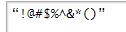
    * Base64 Encode：`:::js 4oCcIUAjJCVeJiooKeKAnQ0K`
    * URL Encode：`:::js %E2%80%9C%21%40%23%24%25%5E%26%2A%28%29%E2%80%9D%0D%0A`

### 加密
* 将字符串（文本）/文件进行重新编码，附加密钥，解密时必须附加密钥，否则无法解密出正确结果
* 分：对称加密（加密解密使用相同密钥）和非对称加密（使用不同密钥）

#### 对称加密
* 包括很多算法，常见的有AES、DES等
* 下列算法不区分大小写，有的软件是大写，有的是小写，统一即可
* 列出部分
* 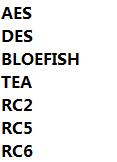

#### 非对称加密
* 一般常用RSA加密，但是较为麻烦
* RSA是区分大小写的
* RSA有公钥和私钥，使用公钥加密，则用私钥解密，用私钥加密，则用公钥解密
* RSA加密每次加密出的文本均不同

### 哈希（HASH）
* 也名散列算法，常见有MD5，不同算法出来的位数不一样，一般显示为16进制（0-9A-F）
* 哈希算法：不可还原，一般用于校验数据完整性和存储密码等数据
* 哈希算法保证相同数据会得出相同的哈希值
* 不同数据得出不同的值（想想就不太可能，16位36进制（MD5）总有用完的时候）
* 根据哈希值推出原文本很困难，（不过据说最近有新算法可以推出一串长文本的md5与已知md5相同）
* 列出部分
* 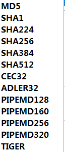

## 关于文件大小的一些事情
* 文件大小与以下数据有关（下方条目必须有上方做支持，如：看文件冗余度必须先压缩）
    * 文件本身大小：文本长度、样式复杂程度，图片位深度、像素大小，视频长度+每帧图片，音频长度、采样频率、位深度
    * 是否压缩：压缩较小
    * 文件冗（rong3）余度：文件相同的部分，相同部分越多，压缩后越小
    * 有损/无损压缩：一般有损压缩（如JPEG）比无损压缩（如PNG）小，但有损压缩不可恢复
    * 压缩算法：高效算法压缩后较小（如（压缩后）7Z小于ZIP）


