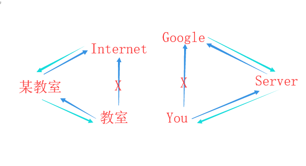
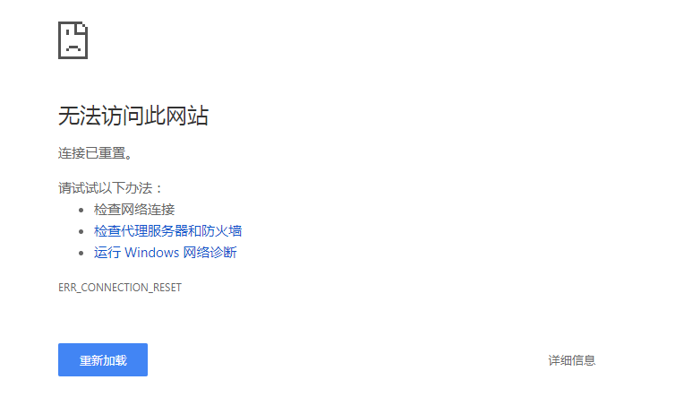

# 翻墙(Climb the Wall)
## 专有名词

| 名词        | 解释                                  |
| ----------- | ------------------------------------- |
| GFW         | Great FireWall                        |
| SS / 小飞机 | ShadowSocks                           |
| SSR         | ShadowSocksR                          |
| PAC         | 代理自动配置，筛选允许通过的URL或IP等 |

## 基本原理
* 
* 众所周知，GFW墙掉了部分网站，如Google，Youtube
* **VPN属于灰色地带，勿大肆宣扬或发布**
* 网站被墙主要表现成为
* 
* 有的网址是整个被墙、有的只是墙掉了部分页面
* 查看被墙的网址和链接（注：base64解码）
* <https://raw.githubusercontent.com/gfwlist/gfwlist/master/gfwlist.txt> 

## 常用软件
* 推荐：ChromeGo-Agent3（直接开SSR，不使用bat）
* 蓝灯（lantern）【能不能用看脸】
    * 不要使用百度搜索蓝灯，会有各类神奇的全家桶网站（当然现在涉及VPN的都被百度干掉了，包括盗版网站）
* SoloVPN【手机】【不可用】
    * 有时会链接不上服务器，等一段时间即可，切换国家
* ShadowSocks【可用】（有手机版本）
    * Ss是一个软件，并不自带服务器，需要填写服务器地址、用户名密码等等
    * 可用找别人提供的ss服务或购买ss服务
* ShadowSocksR（俗称SSR/小飞机）【可用】（有手机版本）
    * Ss的升级版，提供服务器订阅（我也不知道什么玩意）的功能
* GoAgent【可用】
    * Google提供的代理IP地址，需要自建GoogleAppEngine（需翻墙），有已经组合好的整合包，可直接使用
* ChromeGo【可用】
    * 一款VPN整合包，需要搭配Chrome使用，同理有FirefoxFQ
    * <https://github.com/killgcd/chromego>
    * <https://github.com/killgcd/FirefoxFQ> 
* 无界【可用】
    * FLG提供的翻墙软件，首页emm不说了
* 自由门【未测试】
    * 没有找到可用安装包
* <https://zh.greatfire.org/>【未测试】
    * 官网现在无法直接访问，有浏览器等诸多项目
* <https://freeweibo.com/> 
    * 比较有用的，查微博屏蔽内容

## SSR用PAC
* 主要是`userRule`，注意里面填的是不需要过VPN的URL，注意JSON格式

```js
var direct = "DIRECT;";

var wall_proxy = function(){ return "__PROXY__"; };
var wall_v6_proxy = function(){ return "__PROXY__"; };

var ip_proxy = function(){ return wall_proxy(); };
var ipv6_proxy = function(){ return wall_v6_proxy(); };
var nowall_proxy = function(){ return direct; };

/*
 * Copyright (C) 2014 breakwa11
 * https://github.com/breakwa11/gfw_whitelist
 */

var subnetIpRangeList = [
0,1,
167772160,184549376,	//10.0.0.0/8
2886729728,2887778304,	//172.16.0.0/12
3232235520,3232301056,	//192.168.0.0/16
2130706432,2130706688	//127.0.0.0/24
];
var userRule = [
"*.hdslb.com",          //b站
"*.bilibili.com",
"*.cnzz.com",
"*.alicdn.com",
"*.acgvideo.com",
"*.qhres.com",
"*.qhimg.com",
"*.baidu.com",          //百度
"*.bdimg.com",
"*.baidupcs.com",
"*.bdstatic.com",
"*.bcebos.com",
"*.qq.com",             //疼讯
"*.qqmail.com",
"*.weiyun.com",
"*.gtimg.cn",
"*.qpic.cn",
"*.sogo.com",           //搜狗拼音
"*.163.com",            //网易
"*.126.com",
"*.126.net",
"*.netease.com",
"*.upupoo.com",         //UPUPOO
"*.mcmod.cn",           //mcmod
"*.jianrmod.cn",        //moefantasy
"*.moefantasy.com",
"*.zhihu.com",          //知乎
"*.zhimg.com",
"*.kodcloud.com",       //Kod
"*.sinaimg.cn",			//新浪
"*.sinajs.cn",
"*.sina.com",
"*.sina.tw",
"*.sina.com.cn",
"*.weibo.com"
];
function isUserRule(host){
	var isDirect = false;
	for (var i = 0; i < userRule.length; i++) {
		if(shExpMatch(host, userRule[i])){
			isDirect = true;
		}
	}
	return isDirect;
}

var hasOwnProperty = Object.hasOwnProperty;

function check_ipv4(host) {
	var re_ipv4 = /^\d+\.\d+\.\d+\.\d+$/g;
	if (re_ipv4.test(host)) {
		return true;
	}
}
function check_ipv6(host) {
	var re_ipv6 = /^\[?([a-fA-F0-9]{0,4}\:){1,7}[a-fA-F0-9]{0,4}\]?$/g;
	if (re_ipv6.test(host)) {
		return true;
	}
}
function check_ipv6_dns(dnsstr) {
	var re_ipv6 = /([a-fA-F0-9]{0,4}\:){1,7}[a-fA-F0-9]{0,4}(%[0-9]+)?/g;
	if (re_ipv6.test(dnsstr)) {
		return true;
	}
}
function convertAddress(ipchars) {
	var bytes = ipchars.split('.');
	var result = (bytes[0] << 24) |
	(bytes[1] << 16) |
	(bytes[2] << 8) |
	(bytes[3]);
	return result >>> 0;
}
function isInSubnetRange(ipRange, intIp) {
	for ( var i = 0; i < 10; i += 2 ) {
		if ( ipRange[i] <= intIp && intIp < ipRange[i+1] )
			return true;
	}
}
function getProxyFromIP(strIp) {
	var intIp = convertAddress(strIp);
	if ( isInSubnetRange(subnetIpRangeList, intIp) ) {
		return direct;
	}
	return wall_proxy();
}
function FindProxyForURL(url, host) {
	if (shExpMatch(host, "*.hdslb.com")) {
        return direct;
    }
	if (shExpMatch(host, "*.bilibili.com")) {
        return direct;
    }
	if (shExpMatch(host, "*.acgvideo.com")) {
        return direct;
    }
	if ( isPlainHostName(host) === true ) {
		return direct;
	}
	if(isUserRule(host) === true){
		return direct;
	}
	if ( check_ipv4(host) === true ) {
		return getProxyFromIP(host);
	}
	if ( check_ipv6(host) === true ) {
		return ipv6_proxy();
	}

	var strIp = dnsResolve(host);
	if ( !strIp ) {
		return wall_proxy();
	}
	
	return getProxyFromIP(strIp);
}

function FindProxyForURLEx(url, host) {
	if ( isPlainHostName(host) === true ) {
		return direct;
	}
	if ( check_ipv4(host) === true ) {
		return getProxyFromIP(host);
	}
	if ( check_ipv6(host) === true ) {
		return ipv6_proxy();
	}

	var strIp = dnsResolveEx(host);
	if ( !strIp ) {
		return wall_proxy();
	}
	if ( check_ipv6_dns(strIp) === true ) {
		return ipv6_proxy();
	}
	var dnsIps = strIp.split(";");
	if (check_ipv4(dnsIps[0]) === true) {
		return getProxyFromIP(dnsIps[0]);
	} else if (check_ipv6_dns(dnsIps[0]) === true) {
		return ipv6_proxy();
	}
	return wall_proxy();
}
```


