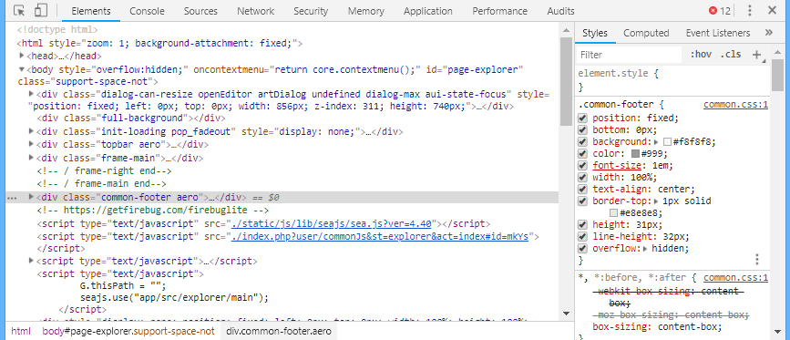
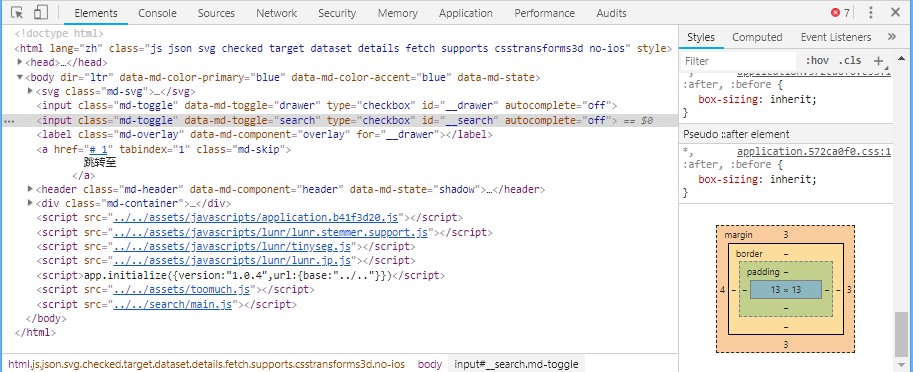

# 浏览器相关
## 浏览器控制台
* 浏览器比较重要的一个东西就是控制台，一般我们按`F12`或右键-审查元素就可以打开
* 浏览器控制台主要有以下几个部分（顺序不一定，是可以按住拖来拖去的）
    * Element：HTML元素（解析完成后的，即：你看到什么就是什么，不完全登陆HTML源码）
    * Console：Js控制台
    * Source：源文件
    * Network：网络
    * Security：安全设置
    * Memory：内存
    * Application：应用和存储
    * 等

## Element
* 解析之后的HTML元素
* 
* 我们可以在左边很简单的看到解析后的HTML元素，也可以使用`Ctrl+F`搜索
* 可以进行编辑，修改，复制等操作
* 选中后右键可以修改伪类（`Focus State`），如`:hover`，可以方便地测试代码
* 在右边可以看到该元素的Style
* 鼠标放上去可以看到左边有个复选框，选中代表了应用，也可以不选中，取消选中后可以看到他被划掉了
* 比较上方的是优先级较高的，在下方的是优先级较低的，
* 在下方的也有时从父级元素继承的，可以发现有`inhert from xxx`字样
* 在下方的元素也有被划掉的，但是他并没有被取消，那是为什么呢？是因为上方有覆盖他的数据，所以他被覆盖掉了
* 浏览器预设样式：`user agent stylesheet`，在相同位置，我们也可以看到相同位置有css来源
* 
* 到Style的最下面，我们可以看到Box
* Box中可以直观看到padding，margin，border

