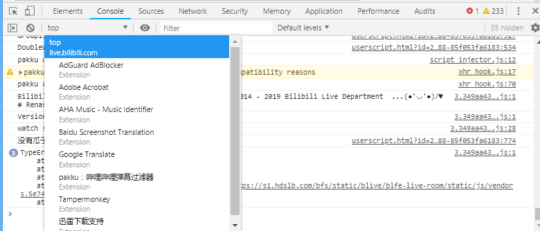
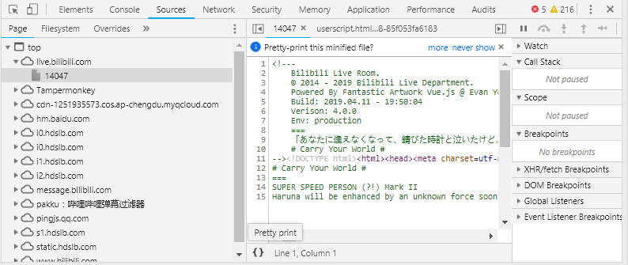
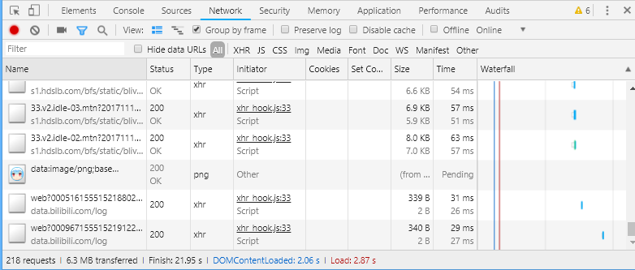
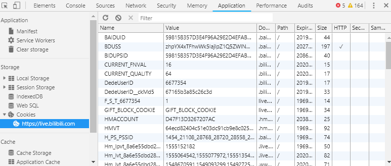

# 浏览器相关
## 浏览器控制台
* 浏览器比较重要的一个东西就是控制台，一般我们按`F12`或右键-审查元素就可以打开
* 浏览器控制台主要有以下几个部分（顺序不一定，是可以按住拖来拖去的）
    * Element：HTML元素（解析完成后的，即：你看到什么就是什么，不完全登陆HTML源码）
    * Console：Js控制台
    * Source：源文件
    * Network：网络
    * Security：安全设置
    * Memory：内存
    * Application：应用和存储
    * 等
* 在选择框左边有两个按钮，是
    * 选择元素（先点击按钮，再点击页面上元素，就会在`Element`上高亮显示）
    * 设备界面（改变`UserAgent`，一般用于测试手机页面等）
* 最右边三个点可以点开，有`Dock Side`可以选择控制台的显示位置，可以在左、下、右或者弹出都可以
* 注意：下列正则表达式不需要感觉很高级，普通的文本也属于正则表达式，比如`hdsdb`

## Element
* 解析之后的HTML元素
* 
* 我们可以在左边很简单的看到**解析后到**的HTML元素，也可以使用`Ctrl+F`搜索
* 可以进行编辑，修改，复制等操作，但是到**不会保存**，刷新就会消失，一般用于临时测试效果，然后复制到编辑页面
* 选中后右键可以修改伪类（`Focus State`），如`:hover`，可以方便地测试代码
* 在右边可以看到该元素的`Style`
* 鼠标放上去可以看到左边有个复选框，选中代表了应用，可以点击，取消选中后可以看到他被划掉了
* 比较上方的是到**优先级到**较高的，在下方的是优先级较低的，
* 在下方的也有时从父级元素到**继承到**的，可以发现有`inhert from xxx`字样
* 在下方的元素也有被划掉的，但是他并没有被取消，那是为什么呢？是因为上方有到**覆盖到**他的数据，所以他被覆盖掉了
* 浏览器到**预设样式到**：`user agent stylesheet`，在相同位置，我们也可以看到相同位置有到`css`来源
* 
* 到`Style`的最下面，我们可以看到`Box`
* `Box`中可以直观看到`padding`，`margin`，`border`

## Console
* 
* 浏览器JS控制台
* 可以看到`Top`，点进去可以选择执行JS代码的页面，其中有各插件和iFrame
* `Top`左边有两个按钮，是
    * 筛选`Console`输出
    * 清空控制台
* 右边有条目，可以使用正则表达式筛选输出
* 在下面可以直接输入JS代码，进行执行
* `Object`、`Array`等数据类型可以直接右键保存到全局变量
* 右键可以清空或保存缓存数据

## Source
* 
* 查看获得的源文件
* 文件左下角有一个`{}`按钮，可以对代码进行格式化，格式化后原本跳转也会直接跳转到格式化后的页面，Network也有该功能

## Network
* 
* 查看浏览器的网络发包
* 可以点进去查看详细，一般作抓包用
* 从左到右按钮
    * 开始/停止记录（红色表示正在记录）
    * 清空
    * 录制截图
    * 筛选菜单栏
        * 筛选正则表达式
        * 隐藏[Data URL](https://developer.mozilla.org/en-US/docs/Web/HTTP/Basics_of_HTTP/Data_URIs)，由于是嵌入到页面里面的，所以可以认为是从本地获取的（一般用于小文件或图片等）（当然也可以从服务器获取data数据（以文本形式））。
        * 筛选请求类型
    * 请求事件流
    * 以框架（`Frame`）归类
    * 保留日志（否则刷新或跳转时会清空）
    * 禁用缓存（看起来不太好用，还是`Ctrl+F5`刷新吧）
    * 离线

## Application
* 
* 这里可以修改、复制、删除`Cookie`、`SessionStorge`、`LocalStorge`
* 用处：某网站懒得退出登录，可以直接删`Cookie`即可
* 清空可以右键左边条目，也可以直接全选+`Delete`

