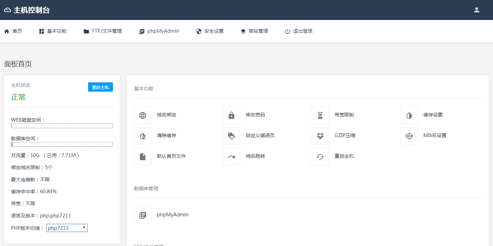

# 服务器
## 概述
* 之前在概述之中已经表述了一些服务器相关内容
* 此处服务器皆指安装了服务器软件的计算机

## 测试服务器
* 有时为了测试和安装软件，我们会在自己的计算机上安装服务器
* 常用的服务器软件有apache
* 推荐安装[Appserv](https://www.appserv.org/en/)，包括Apache、Mysql、PHP，很方便

!!!tip "php版本"
    * Apache安装后PHP版本默认是5.6
    * 在安装后可以切换php版本至7.0
    * 可以使用PHP Version Switch进行切换（安装时会在开始菜单创建快捷方式，也可去安装目录找）

!!!warning "提示"
    * 不要更改安装目录，否则会造成数据库奇怪的问题
    * 虽然安装时需要输入密码，但是实际上是没有密码的，使用数据库需要root账号登陆，然后设定密码

## 正式服务器
* 正式使用的虚机一般是没法定装啥系统的
* 但是一般都是用的Nginx+EasyPanel（也有简称EP的），当然那些大厂虚机另外算，当然价格也是另外算的
* 

## 一些服务器软件
* 编辑器：KodExplorer
* 数据库管理：Adminer（当然phpMyAdmin也是可以的，不过个人认为他文件多比较烦），KOD自带，反正只需要一个文件（可选的CSS文件）

