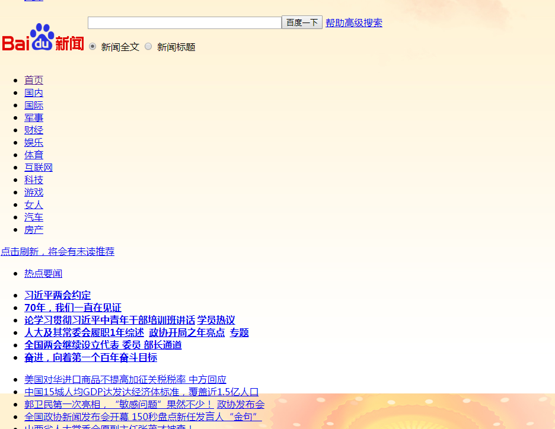
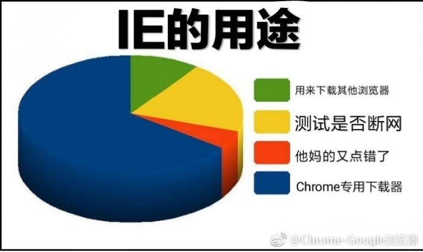
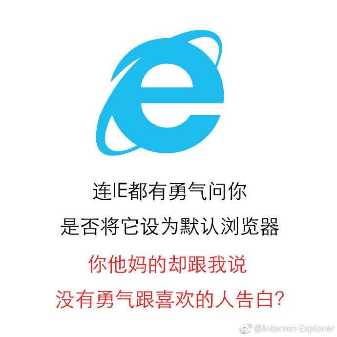

# 网页编程相关
## 说在前面
### 关于网页（客户端）
* 网页（此处特指在浏览器中看到的内容，只客户端语音，本段下同）主要由HTML、CSS、JS构成，这当然在你们的信息书上都有，<c>只不过你们看不看就不知道了</c>
* HTML主要构成网页页面的框架，如表格，各种框，链接，文本等
* CSS主要修改HTML元素的样式，你所看到的好看的网页中一定有CSS的效果，走着你看到的就是下面这个图（在网不好没加载出CSS文件和远古版本的网页内容就是这样）
* 
* JS主要应用于网页的动态效果，当然也可以进行批量的操作
* 根据目前的趋势，偏向效果的动画都向CSS靠（现在CSS也可以做动画，如animation属性）

### 浏览器
* 如今市面上的浏览器主要分IE核心（EdgeHTML和老版本），FireFox（Gecko），Chrome/Chromium（WebKit），所以有些CSS前面会加一堆前缀，<c>传说IE准备放弃Edge转投Google了</c>
* IE：你下载其他浏览器的最好选择
* 
* 
* Chrome：快，吃内存
* 
* 
* 如今国产浏览器基本是双核心的，用于普通网站（极速模式）和一些政府或支付网站（兼容模式）
* 至于红芯：欢迎使用红芯Chrome浏览器
* 
* 在设计网页时候基本向Webkit（极速模式）靠拢
* 推荐使用GoogleChrome（核心是Chromium），及时更新，现在Chrome在中国的服务恢复了，但是好像更新出了点问题，总是报有更新

### 网页（服务器）
* 想要让互联网（或局域网）上的用户都能访问我们的网站，我们需要将网页放置在服务器上

???tip "服务器"
    * 此处服务器指的是：安装了服务器软件的计算机<c>其实信息书上有</c>
    * 服务器软件可安装在普通系统上（如Win7、Win8等），也可以安装在其他定制的服务器系统上（如Win Server 2012），这类系统去掉了一些服务器不需要的服务和功能，并做了针对性优化，当然大部分还是用Linux的，毕竟图形化操作都省了
    * 比较贫穷没有小钱钱买服务器的，一般使用虚拟主机（简称虚机）服务，基本原理是服务提供商在一台服务器上划分一定资源和存储空间给你，相当于很多人一起使用一台服务器

* 服务器中有两大类文件：静态文件和动态文件
    * 静态文件
        * 又称静态资源（assets、static）
        * 顾名思义，不动的文件，即：直接访问其本身，每次访问内容相同
        * 包括：HTML、JS、CSS、PNG、JPG、MP4、PDF等文件
        * 当然我们也可以使用一些高级方法，使以上这些文件每次获取内容不同，但那就不属于静态文件了
        * 由于某些静态文件非常大，或是常常需要访问很多次，那么会非常占用我们服务器的资源，用户也会觉得加载很慢，所以可以将它放在一些静态存储服务（如对象存储）中，使用CDN（内容分发网络）也可以对其进行加速
        * 用户首次加载静态文件时，浏览器会将文件存储下来，下次再次获取该文件时，就不再从服务器中获取，而是直接读取已存储的文件（缓存）
        * 一些普遍的JS、CSS文件（如Jquery、BootStrap等）可以使用公共CDN进行加速（原理：先访问了a.com，其中加载了文件cdn.com/Jquery.js，后访问了b.com，加载了相同文件cdn.com/Jquery.js，那么就会直接读取缓存中的该文件，无需再次从cdn.com下载该文件），

