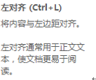

# 常用快捷键

| 快捷键              | 含义/备注                                         |
| ------------------- | ------------------------------------------------- |
| Ctrl + C            | 复制                                              |
| Ctrl + X            | 剪切                                              |
| Ctrl + V            | 黏贴                                              |
| Ctrl + D            | 复制并黏贴（部分） / 向下填充（Excel）            |
| Ctrl +A             | 全选                                              |
| Ctrl + I            | 斜体                                              |
| Ctrl + B            | 加粗                                              |
| Ctrl + U            | 下划线                                            |
| Ctrl + Z            | 撤销（部分有Ctrl + Alt +Z）                       |
| Ctrl + Y            | 前进（部分无，部分未Ctrl + Alt +Y）               |
| Ctrl + H            | 替换                                              |
| Ctrl + F            | 搜索                                              |
| Ctrl + S            | 保存                                              |
| Win + R             | 运行                                              |
| Win + P             | 投影屏幕设置                                      |
| F5                  | 刷新                                              |
| Ctrl + F5           | 完全刷新（所有资源完全从服务器获取）              |
| F11                 | 全屏                                              |
| F12                 | 控制台（浏览器）                                  |
| Ctrl + Alt + A      | QQ截图（需要开着QQ）                              |
| Ctrl + Alt + Delete | XP-：任务管理器  7+：安全窗口                     |
| Ctrl + Shift + Esc  | 7+：任务管理器                                    |
| Alt + F4            | 关闭窗口（多页面如浏览器直接关闭浏览器）          |
| Ctrl + W            | 关闭窗口（多页面如浏览器关闭浏览器当前选项卡）    |
| Ctrl + 左键拖拽     | 选中文本/图片后按住Ctrl+鼠标左键拖拽复制文本/图片 |
| Ctrl + G            | 组合                                              |
| Ctrl + Shift + G    | 取消组合                                          |
| Ctrl + Shift + C    | 复制格式                                          |
| Ctrl + Shift + V    | 粘贴格式                                          |

快捷键的查看：Eg：